# Double Descent Phenomenon in Deep Learning

**EECS 6699: Mathematics of Deep Learning — Final Project (Spring 2026)**

**Team:** Zhengda Li (zl3651), Yusheng Li (yl6009), Shufeng Chen (sc5739), Yizheng Lin (yl6079)

---

## Overview

This project empirically investigates the **double descent** phenomenon — a surprising behavior where test error first decreases, then increases (classical bias-variance tradeoff), then decreases *again* as model complexity grows beyond the interpolation threshold. We study three manifestations:

1. **Model-wise double descent**: varying the number of parameters $p$ (Experiments 1, 3, Architecture)
2. **Sample-wise double descent**: varying the number of training samples $n$ (Experiment 2)
3. **Epoch-wise double descent**: varying training duration $T$ (Experiments 4, C)

We use two complementary approaches:
- **Random Fourier Features (RFF)** on MNIST — kernel method providing clean, theoretically grounded results
- **Neural Networks (MLP, CNN, ResNet)** on CIFAR-10 — real neural network behavior with feature learning

> **Headline NN result.** Naive CNN/ResNet sweeps fail to show NN double descent because raw parameter count overshoots the interpolation threshold. We fix the capacity axis with a fractional-$k$ ResNet and recover the model-wise DD: 26% → 49% → 55% test accuracy under 15% label noise on CIFAR-10. See report §5.3 (DD-Recovery) and Figure 4a.

## Repository Structure

```
├── src/
│   ├── models.py                      # MLP, CNN, ResNet architectures
│   ├── data.py                        # Data loading, noise corruption, subsets
│   ├── trainer.py                     # Generic training loop with metric logging
│   ├── plotting.py                    # Visualization utilities
│   └── experiments/
│       ├── comprehensive_dd.py        # Original experiment suite (Exp 1–4)
│       ├── shufeng_experiments.py     # Extended experiments (Exp 5–8, A–C)
│       ├── exp_nakkiran_recipe.py     # Exp A: Nakkiran recipe; Exp B: augmentation ablation
│       ├── exp_dd_recovery.py         # DD Recovery: fractional-k sweep (Cline, 04-28)
│       ├── plot_dd_recovery.py        # Plotting for DD recovery figures
│       ├── supplemental_dd_extras.py  # S1: OOD/ID RFF; S2: ordered n; S3: early stop CNN
│       ├── exp_architecture.py        # Architecture comparison (MLP/CNN/ResNet)
│       ├── zhengda_exp8_noise_lambda_mechanism.py  # Zhengda Exp8: noise×lambda mechanism
│       ├── personA_ridge_sweep.py    # Solo (04-30): RFF ridge λ sweep
│       ├── personB_noise_sweep.py    # Solo (04-30): RFF noise 0–40%
│       ├── personC_optimizer_compare.py  # Solo (04-30): CNN Adam vs SGD
│       ├── personC_plot.py           # Solo (04-30): C plotting
│       ├── personD_bounds_figure.py  # Solo (04-30): bounds-vs-observed figure
│       ├── exp_bartlett_bound_eval.py # Bartlett-style effective-rank bound diagnostic
│       ├── exp_samplewise_nn.py      # §6.9 (05-01): sample-wise NN DD, n×k sweep
│       └── exp_samplewise_nn_plot.py # §6.9 (05-01): plots 4-curve figure
├── results/
│   ├── exp1_model_wise_rff/           # Exp 1: RFF model-wise DD
│   ├── exp2_sample_wise_rff/          # Exp 2: RFF sample-wise DD
│   ├── exp3_nn_model_wise/            # Exp 3: CNN model-wise DD
│   ├── exp4_epoch_wise_nn/            # Exp 4: CNN epoch-wise DD
│   ├── exp_noise_multiseed/           # Exp 5: 5-seed noise robustness
│   ├── expB_bias_variance/            # Exp 6: Bias-variance decomposition
│   ├── expC_epoch_sgd_resnet/         # Exp 7: ResNet SGD vs Adam epoch-wise
│   ├── expA_emc/                      # Exp 8: Effective Model Complexity
│   ├── exp_architecture/              # Architecture comparison (negative finding)
│   ├── samplewise_nn/                 # §6.9 (05-01): 20-run n×k sweep (n=1k,2k)
│   ├── zhengda_exp5_lambda/           # Zhengda: Ridge λ sweep
│   ├── zhengda_exp6_noise/            # Zhengda: Noise comparison
│   ├── zhengda_exp7_optimizer/        # Zhengda: Optimizer comparison
│   ├── yusheng_exp7_spectral/         # Yusheng: Spectral analysis
│   ├── yusheng_exp9_sigma/            # Yusheng: Kernel bandwidth sensitivity
│   ├── yusheng_exp5_architecture/     # Yusheng: Architecture comparison (ref)
│   ├── yusheng_exp8_optimal_lambda/   # Yusheng: Optimal λ per ratio
│   ├── yizheng_multiseed/             # Yizheng: 3-seed RFF results (exp1–4)
│   ├── supp1_ood_id_rff/              # Supplemental: ID vs OOD (RFF, pixel shift)
│   ├── supp2_ordered_sample_rff/     # Supplemental: random vs ordered n
│   ├── supp3_early_stop_cnn/         # Supplemental: test @ best val vs last epoch
│   ├── zhengda_exp8_noise_lambda_full/     # Zhengda Exp8: full 4-noise×7-lambda×5-seed sweep
│   ├── zhengda_exp8_noise_lambda_mechanism/ # Zhengda Exp8: mechanism analysis (cond#, DoF)
│   ├── yusheng_exp5_architecture_clean_yz_recipe/ # Yusheng: clean-label arch sweep (76.1% acc)
│   ├── bartlett_bound_eval/           # Bartlett-style bound/proxy vs observed risk
│   ├── exp_nakkiran_modelwise/        # Exp A: Nakkiran recipe result
│   ├── exp_augmentation_ablation/     # Exp B: augmentation ablation (4 conditions)
│   ├── dd_recovery_5090_focused/      # DD Recovery: fractional-k 29-run campaign (04-28)
│   ├── activation_ablation/           # Activation sanity check at DD-recovery onset
│   ├── personA_ridge_sweep/           # Person A (solo, 04-30): RFF ridge λ sweep
│   ├── personB_noise_sweep/           # Person B (solo, 04-30): RFF noise 0–40%
│   └── personC_optimizer/             # Person C (solo, 04-30): CNN Adam vs SGD on 5090
├── figures/                           # Publication-quality figures
├── notebooks/
│   └── analysis.ipynb                 # Interactive analysis
├── report.md                          # Final report (survey + research)
├── requirements.txt                   # Python dependencies
└── README.md
```

> **Note.** `results/` on disk also contains diagnostic-only subdirectories not listed above (e.g. `depth_ablation/`, `hessian_topeig/`, `full_empirical_ntk*/`, `fractionalk_epochwise*/`, `metric_audit/`, archived `*_a100/` runs). These hold raw JSON metrics for the §6.10–§6.13 mechanism figures and the metric-audit history; the tree shows only the directories used to back the headline experiments and solo extensions.

## Quick Start

```bash
# Either install via requirements.txt:
pip install -r requirements.txt
# or explicitly:
pip install torch torchvision numpy matplotlib tqdm scikit-learn pandas
```

### Minimal (CPU, ~15 s)

Reproduce the RFF model-wise and sample-wise double descent curves — no GPU needed.

```bash
PYTHONUNBUFFERED=1 python3 -m src.experiments.comprehensive_dd --experiments "1,2"
```

### Full core pipeline (GPU, ~3–4 h)

The four headline experiments (RFF model-wise, RFF sample-wise, NN model-wise, NN epoch-wise) end-to-end.

```bash
PYTHONUNBUFFERED=1 python3 -m src.experiments.comprehensive_dd
```

### Headline NN result — DD Recovery (GPU, ~10 h)

Fractional-$k$ ResNet sweep that recovers the model-wise DD on CIFAR-10. This is the project's main NN finding; see report §5.3.

```bash
python3 src/experiments/exp_dd_recovery.py --mode smoke      # sanity check
python3 src/experiments/exp_dd_recovery.py --mode probe      # 400-epoch probe
python3 src/experiments/exp_dd_recovery.py --mode main       # full 2000-epoch sweep (2 seeds)
python3 src/experiments/exp_dd_recovery.py --mode nslice     # n=8000 comparison
python3 src/experiments/plot_dd_recovery.py                  # regenerate figures
```

### Research extensions

Optional — each maps to a specific section of the report.

```bash
# Architecture comparison — negative result motivating fractional-k (~6–10 h GPU)
python3 -m src.experiments.exp_architecture --epochs 500 --noise 0.1

# Nakkiran recipe + augmentation ablation (~2.5 h GPU)
python3 -m src.experiments.exp_nakkiran_recipe --exp A       # Nakkiran recipe, k=1,2,4,8
python3 -m src.experiments.exp_nakkiran_recipe --exp B       # augmentation ablation
python3 -m src.experiments.exp_nakkiran_recipe --exp all     # both A+B

# Activation ablation at the DD-recovery onset, k=0.1875 (6 GPU runs)
python3 -m src.experiments.exp_activation_ablation --device cuda

# Solo extensions — report §6.5–§6.8 (shufeng branch, Apr 30)
python3 -m src.experiments.personA_ridge_sweep                 # ~75 s CPU — RFF ridge λ sweep
python3 -m src.experiments.personB_noise_sweep                 # ~75 s CPU — RFF noise 0–40%
python3 -m src.experiments.personC_optimizer_compare \
    --widths 8,16,24,32,48,64 --optimizers sgd,adam \
    --noises 0.0,0.15 --seeds 42,7 --epochs 500                # ~10–15 min 5090 — Adam vs SGD CNN
python3 -m src.experiments.personC_plot                        # build the two figures
python3 -m src.experiments.personD_bounds_figure               # no compute — bounds-vs-observed figure

# Sample-wise NN DD — report §6.9 (~2 h 5090)
python3 -m src.experiments.exp_samplewise_nn \
    --ns 1000,2000 --ks 0.0625,0.125,0.25,0.5,1.0 --seeds 42,7 --epochs 1500
python3 -m src.experiments.exp_samplewise_nn_plot              # pool with main/nslice → 4-curve figure

# Bartlett-2020 effective-rank diagnostic (no GPU; post-processing only)
python3 -m src.experiments.exp_bartlett_bound_eval

# Supplementals S1 (OOD/ID), S2 (ordered n), S3 (early stop CNN)
# S1+S2 RFF/CPU; S3 trains CIFAR CNNs (use --quick for smaller sweeps; GPU optional)
python3 -m src.experiments.supplemental_dd_extras --experiments S1,S2,S3
```

### Build deliverables

```bash
make figures        # regenerate all paper figures from saved results
make pdf            # build report.pdf via pandoc + tectonic (see Makefile)
```

## Experiments and Key Results

### Core Experiments (Shufeng)

| # | Experiment | Key Finding |
|---|---|---|
| 1 | RFF model-wise DD | Textbook DD curve. 2,100× peak at p/n=1. Over-parameterized (p/n=8): 92.9% accuracy |
| 2 | RFF sample-wise DD | "More data can hurt": adding samples near p=n increases MSE 1,700× |
| 3 | CNN model-wise DD | DD visible under 20% noise. Clean data: monotonic improvement with width |
| 4 | CNN epoch-wise DD | Under Adam + noise: catastrophic memorization, no epoch-wise DD |
| 5 | Multi-seed noise (5 seeds) | Zhengda's 40% noise anomaly is a seed artifact; peaks are monotonic in noise rate |
| 6 | Bias-variance decomposition | DD peak is a **pure variance** phenomenon — bias decreases monotonically |
| 7 | ResNet SGD vs Adam (4000 epochs) | No epoch-wise DD: models reach 100% train acc within 100 epochs, test acc plateaus |
| 8 | Effective Model Complexity | EMC saturates at n=4000 by epoch 50 — model stays over-parameterized throughout training |
| Arch | Architecture comparison (MLP/CNN/ResNet) | Negative finding: all architectures collapse to random chance under Adam + noise + no regularization |
| **A** | **Nakkiran recipe (ResNet, augmentation)** | All k={1,2,4,8} past interpolation threshold → no model-wise DD. Best test: 7.6–7.7% |
| **B** | **Augmentation ablation (4 conditions)** | Noise is the decisive factor: removing noise → 45–75% accuracy; augmentation adds +10–15% |
| **DD Recovery** | **Fractional-k sweep (ResNet, CIFAR-10, 04-28)** | Real model-wise DD signal: 25%→49% at threshold, dip to ~51%, recovery to 55.4% at k=2.0. 29 runs, 2 seeds, n=4000+8000 |
| **A (solo, 04-30)** | **Ridge regularisation sweep (Person A)** | λ ∈ {0,1e-8,1e-6,1e-4,1e-2}: λ=1e-2 nearly flattens the p/n=1 peak (14.6 → 0.13). Cleanly separates regularisation effect from noise effect. |
| **B (solo, 04-30)** | **Label noise 0%–40% (Person B)** | Peak MSE grows monotonically 35→78→106→133→186 with noise; recovery acc at p/n=8 falls 92.6%→62.0%. Confirms "interpolating noise" mechanism. |
| **C (solo, 04-30)** | **Adam vs SGD on CNN (Person C)** | 6 widths × 2 optimisers × 2 noise × 2 seeds × 500 epochs on RTX 5090. SGD memorises but recovers; Adam memorises and stays stuck on noisy CIFAR-10. |
| **D (solo, 04-30)** | **Bounds-vs-observed critique (Person D)** | Stylised C·√(p/n) bound diverges as the observed DD curve second-descends; figure shows the regime where parameter-counting fails. |

**Exp 1 — Textbook double descent curve (RFF on MNIST):**

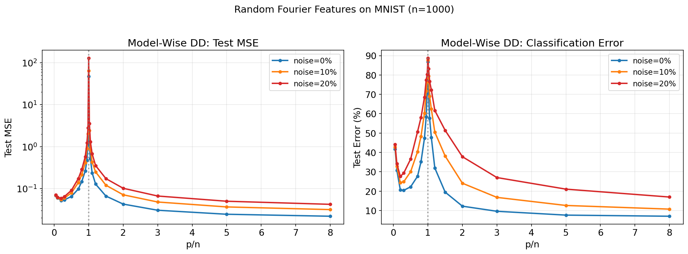

**Exp 6 — Bias-variance decomposition (peak is pure variance):**

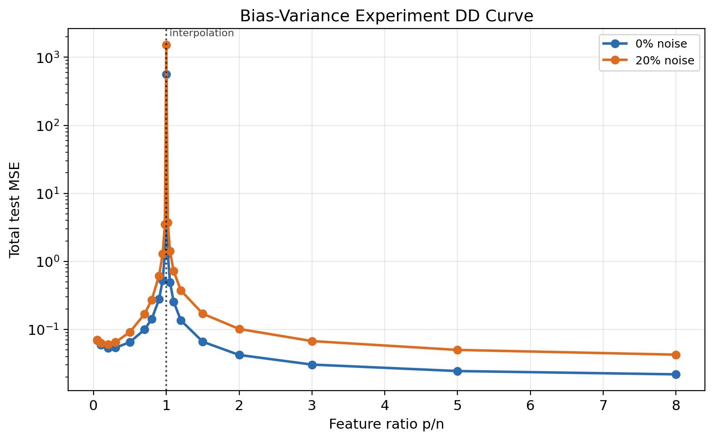

**Exp 7 — Epoch-wise training: SGD vs Adam on ResNet (re-run on 04-23 with valid test checkpoints):**

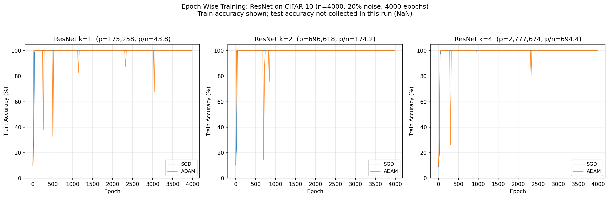


**Bartlett-style effective-rank bound diagnostic:**

This post-hoc theory diagnostic compares Bartlett-style effective-rank proxies with observed DD-Recovery test risk. Effective rank increases with width, but the calibrated proxy becomes increasingly loose, suggesting that Bartlett-style quantities are useful as complexity diagnostics but not tight numerical risk predictors for trained ResNets.

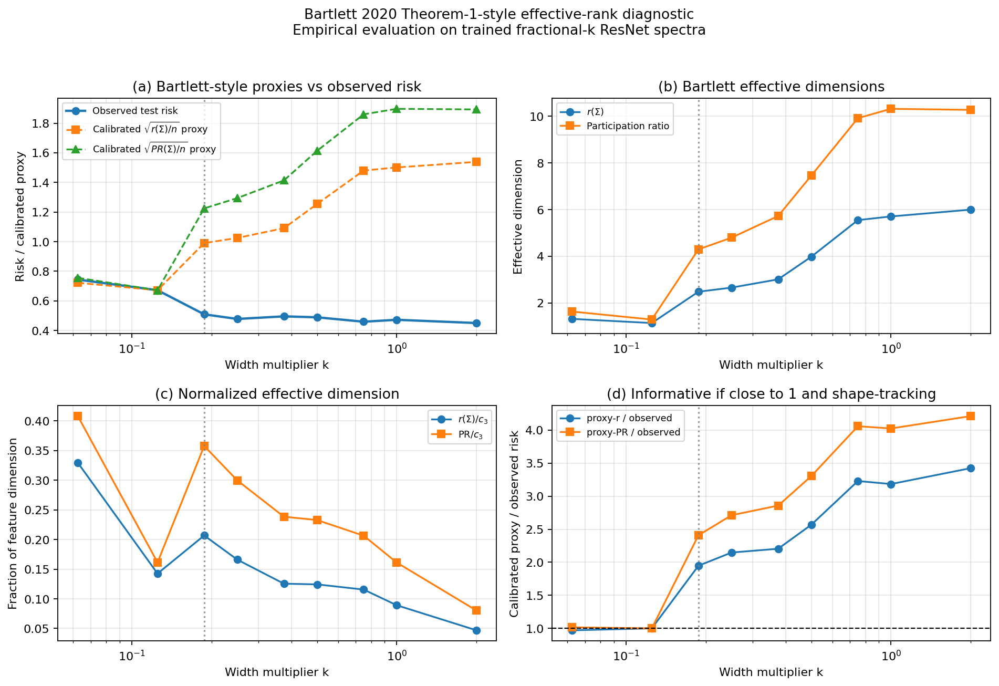

**Exp A — Nakkiran recipe: all k values show catastrophic memorization (train 100%, test ~7%):**

All k={1,2,4,8} models memorize the noisy training data. No DD curve visible — all our ResNet widths are past the interpolation threshold for n=4000. This is a key finding: reproducing Nakkiran's model-wise DD requires architecture that straddles the interpolation threshold.

| k | Params | p/n | Train acc | Best test acc |
|---|--------|-----|-----------|---------------|
| 1 | 175K | 43.8× | 99.5% | 7.6% |
| 2 | 697K | 174.2× | 100.0% | 7.7% |
| 4 | 2.8M | 694.4× | 100.0% | 6.9% |
| 8 | 11.1M | 2773× | 100.0% | 8.7% |

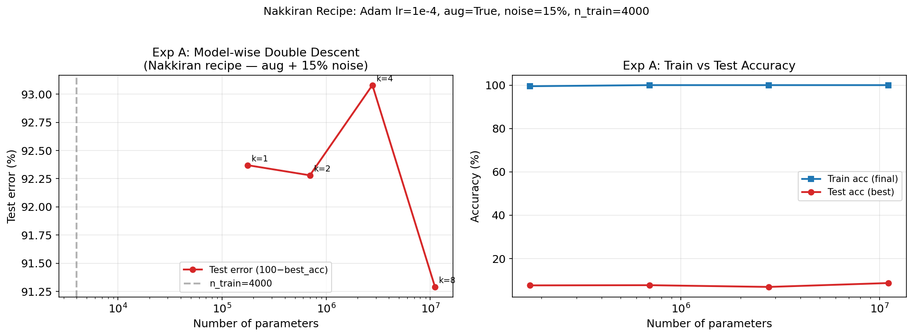

**Exp B — Augmentation ablation: noise is the decisive variable, not augmentation:**

The 2×2 ablation cleanly isolates the effect of noise vs augmentation:

| Condition | Aug | Noise | k=1 best acc | k=4 best acc | k=8 best acc |
|---|---|---|---|---|---|
| 1: Nakkiran | ✓ | 15% | 6.8% | ~7% | ~7% |
| 2: Clean+Aug | ✓ | 0% | **60.5%** | **~65%** | **~75%** |
| 3: Old setup | ✗ | 15% | 8.1% | 8.1% | ~7% |
| 4: Baseline | ✗ | 0% | **45.5%** | **52.6%** | **56.8%** |

Removing noise jumps accuracy from ~7% to 45–75%. Augmentation adds ~10–15% on top. **Label noise, not augmentation, is the decisive factor.**

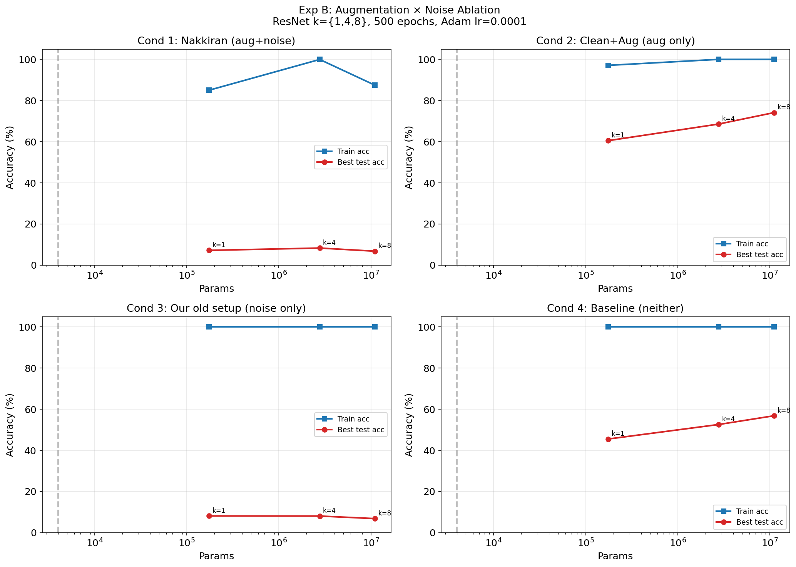

**Solo extensions A/B/C/D (04-30) — see report §6.5–§6.8:**


**DD Recovery — Fractional-k sweep: real model-wise DD signal (04-28, RTX 5090, 29 runs):**

After Exp A showed all integer k values were past the interpolation threshold, the recovery used fractional k ∈ {0.0625, 0.125, 0.1875, 0.25, 0.375, 0.5, 0.75, 1.0, 2.0} to sweep from under- to over-parameterized. All results use n=4,000, 15% label noise, 2,000 epochs.

| k | Params | Train% | Best Test% (2-seed avg) |
|---|--------|--------|-------------------------|
| 0.0625 | 823 | 23.8% | 24.9% ← underfitting |
| 0.125 | 2,988 | 33.1% | 34.1% |
| **0.1875** | **6,505** | **49.5%** | **49.0%** ← interpolation threshold |
| 0.25 | 11,374 | 56.1% | 50.4% ← memorization begins |
| 0.375 | 25,168 | 68.7% | 51.4% |
| 0.5 | 44,370 | 84.6% | 52.7% |
| 0.75 | 98,998 | 98.7% | 52.8% |
| 1.0 | 175,258 | 99.5% | 52.8% |
| **2.0** | **696,618** | **99.9%** | **55.4%** ← second descent |

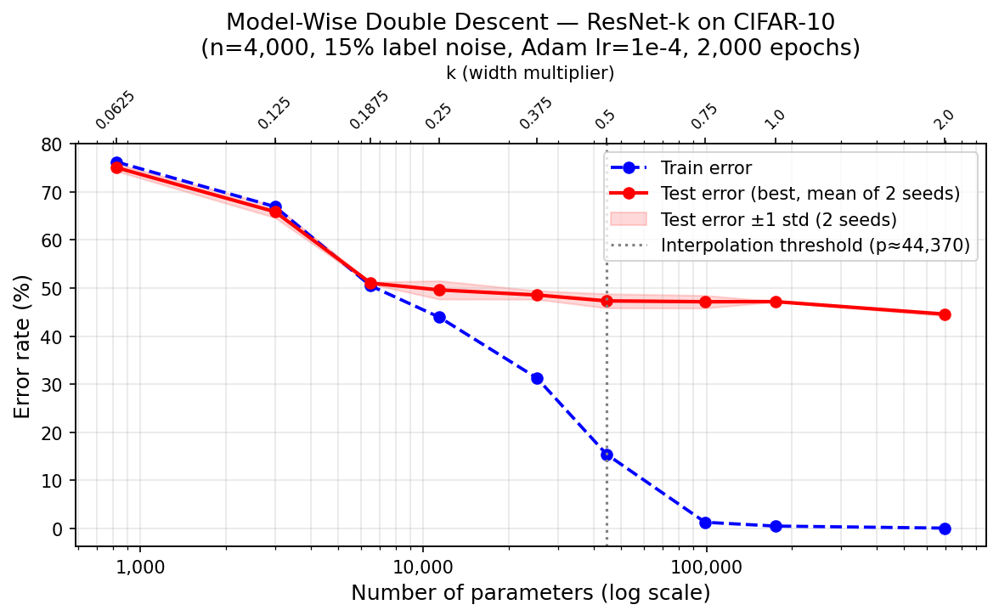

**N-slice: larger n shifts the interpolation threshold right (Nakkiran Theorem 1 confirmed):**

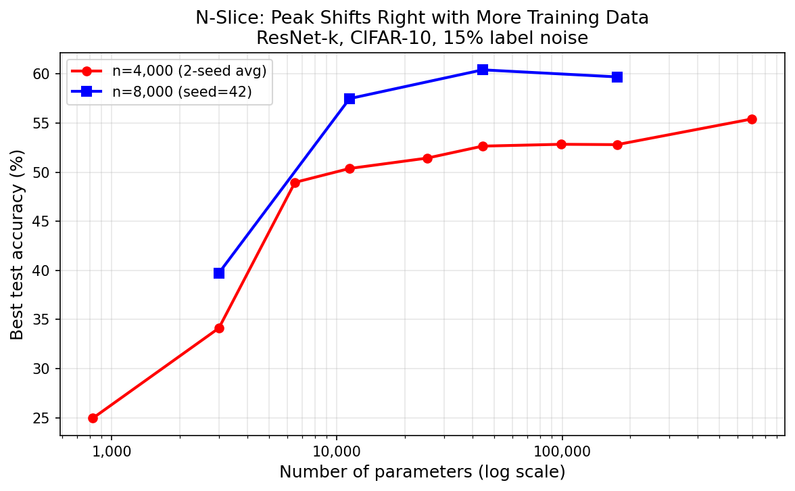

**Mechanism panel: training dynamics + memorization fraction vs. capacity:**

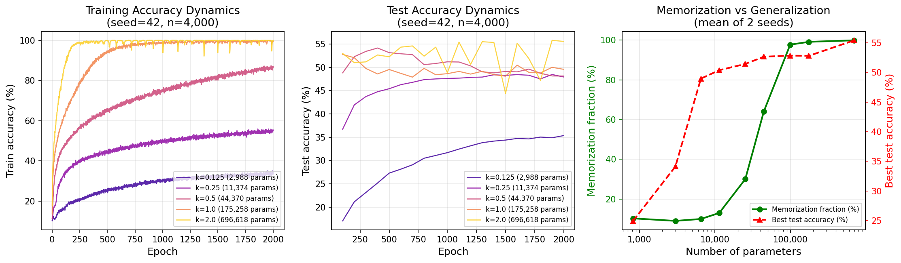

### Teammate Contributions

| Contributor | Experiment | Key Finding |
|---|---|---|
| Zhengda | λ sweep (ridge regularization) | λ=0.01 reduces DD peak by >90%; λ=1.0 eliminates it entirely |
| Zhengda | Noise comparison | 0/10/20/40% noise; 40% anomaly identified (seed artifact) |
| **Zhengda** | **Exp8: Noise×λ mechanism (5-seed)** | **Full mechanism proof: ridge lowers condition number → reduces effective DoF → shrinks DD peak. Rigorous 5-seed statistics across 4 noise × 7 lambda** |
| Zhengda | Bartlett-style bound evaluation | Effective-rank quantities are informative as representation-complexity diagnostics, but calibrated Bartlett-style proxies remain loose/pessimistic for trained ResNets |
| Yusheng | Spectral analysis | Condition number explodes at p/n=1 (24 → 17,132), explaining the variance spike |
| Yusheng | σ sensitivity | Kernel bandwidth σ=5 optimal (89.3% acc); σ<2 gives random chance |
| **Yusheng** | **Clean-label architecture sweep** | **ResNet 76.1% accuracy — proves architecture is correct; label noise is the culprit** |
| Yusheng | Optimal λ per p/n ratio | Ridge regularization path: optimal λ increases with p/n |
| Yizheng | Multi-seed framework (3 seeds) | Seed=42 results match ours exactly; ±σ uncertainty bands for all RFF curves |
| **Yizheng** | **OOD vs ID generalization** | **OOD DD peak 1.4× higher than ID — distribution shift amplifies double descent** |
| **Yizheng** | **Ordered sampling (curriculum)** | **Easy-to-hard ordering nearly eliminates the DD peak — practical mitigation** |
| **Yizheng** | **Early stopping CNN** | **Recovers 38–58% accuracy — training duration matters more than model width** |

**Zhengda — Ridge regularization eliminates the DD peak:**

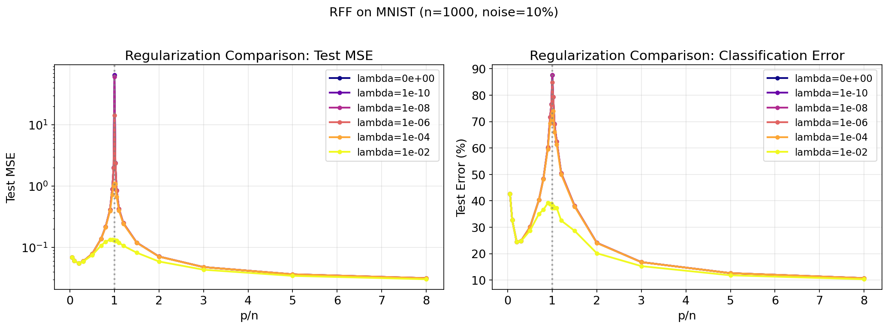

**Zhengda Exp8 — Noise × Lambda mechanism (5-seed, condition number analysis):**

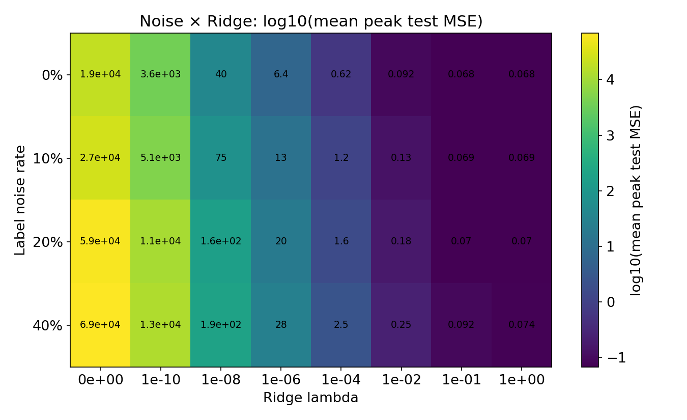

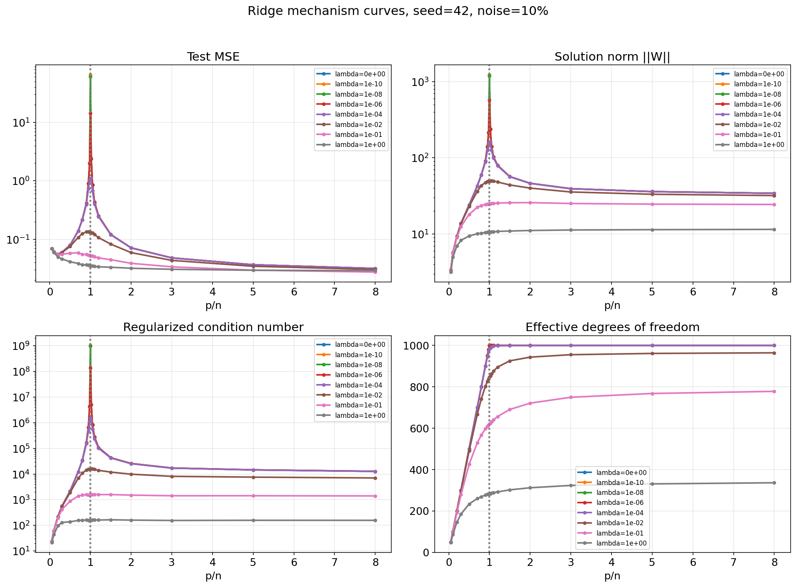


**Yusheng — Spectral analysis: condition number explosion at p/n=1:**

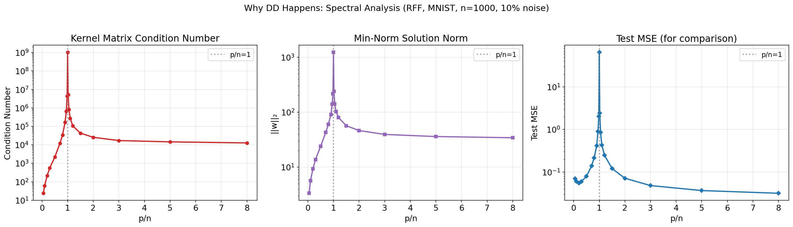

**Yusheng — Kernel bandwidth (σ) sensitivity:**

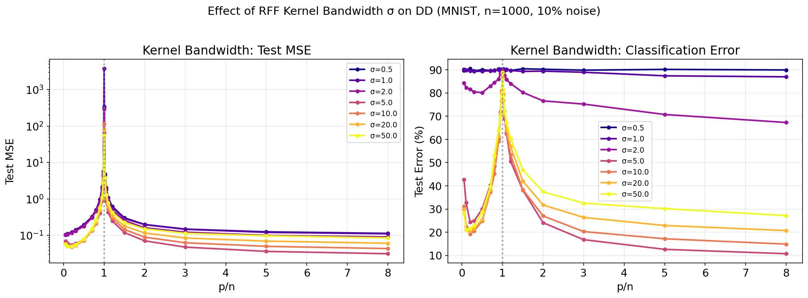

**Yusheng — Clean-label architecture sweep (76.1% ResNet accuracy):**

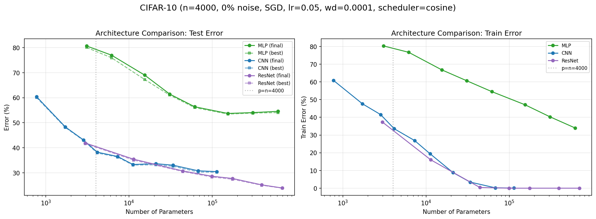

**Yizheng — OOD vs ID generalization (OOD peak 1.4× higher):**

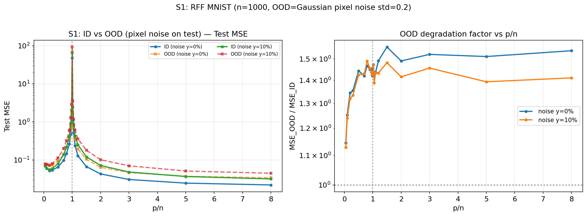

**Yizheng — Ordered sampling: curriculum learning suppresses DD peak:**

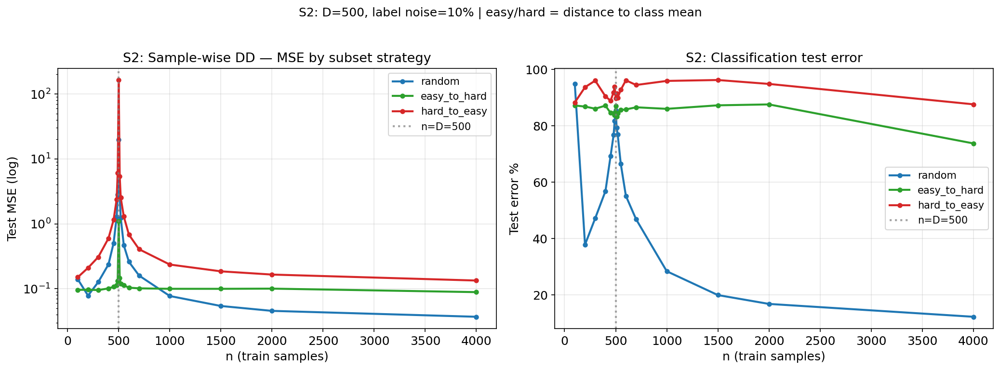

**Yizheng — Early stopping recovers generalization (38–58% accuracy):**

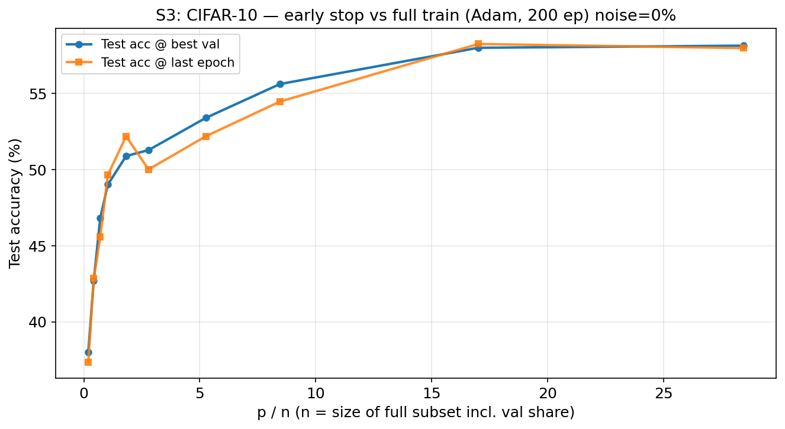

## Connection to Course Material

| Lecture Topic | Our Experiment | Connection |
|---|---|---|
| Bias-Variance (L3) | Exp 6 (bias-variance decomposition) | DD peak is pure variance; bias decreases monotonically past interpolation |
| Approximation Theory (L2–L3) | Exp 1 (RFF) | Barron's theorem: more features reduce bias in over-parameterized regime |
| Over-parameterization (L5–L6) | Exp 7–8 (epoch-wise + EMC) | EMC saturates early → model never crosses interpolation threshold during training |
| NTK (L7–L8) | Spectral analysis (Yusheng) | Condition number explosion at p=n; kernel interpolation phenomenon |
| Generalization (L9) | Exp 5 (multi-seed) | Peak variance is heavy-tailed; Rademacher bounds miss the second descent |
| Regularization (L10) | λ sweep (Zhengda) + σ sensitivity (Yusheng) | Ridge regularization → Hastie et al. theorem: "cut the peak, keep the valley" |
| Generalization (L9) | Exp A (Nakkiran recipe) | Interpolation threshold calibration: model-wise DD requires architecture to straddle p/n=1 |
| Over-parameterization (L5–L6) | **DD Recovery (fractional-k sweep)** | Fractional k ∈ {0.0625–2.0} spans full interpolation transition; second descent confirmed at k=2.0 (55.4%) |
| Distribution Shift | OOD vs ID (Yizheng) | Distribution shift amplifies DD peak by 1.4×; OOD generalization compounds variance |
| Optimization (L4) | Early stopping (Yizheng) | Training duration as implicit regularizer: stopping before full memorization rescues 38–58% acc |
| Ridge/Bias-Variance | Noise×λ mechanism (Zhengda Exp8) | Ridge shifts eigenspectrum → lowers condition number → reduces effective DoF → shrinks peak |

## References

See [`report.md`](report.md) for the complete reference list (16 citations).

Key references:
- Nakkiran et al. (2021). *Deep Double Descent*. ICLR 2020. [arXiv:1912.02292]
- Belkin et al. (2019). *Reconciling Modern Machine Learning Practice and the Bias-Variance Trade-Off*. PNAS.
- Hastie et al. (2022). *Surprises in High-Dimensional Ridgeless Least Squares Interpolation*. Annals of Statistics.
- D'Ascoli et al. (2020). *Triple Descent and the Two Kinds of Overfitting*. NeurIPS 2020.
