# The Double Descent Phenomenon: An Empirical and Theoretical Investigation

## EECS 6699: Mathematics of Deep Learning — Final Report

**Spring 2026, Columbia University**

**Team Members:** Zhengda Li (zl3651), Yusheng Li (yl6009), Shufeng Chen (sc5739), Yizheng Lin (yl6079)

---

## Abstract

Classical statistical learning theory predicts a U-shaped bias-variance tradeoff: increasing model complexity first reduces test error (decreasing bias) then increases it (increasing variance). Modern deep learning defies this prediction — massively over-parameterized models can generalize despite having far more parameters than training samples. This paper investigates the *double descent* phenomenon through a single pipeline: first we reproduce textbook kernel double descent with Random Fourier Features (RFF) on MNIST; then we show why naive CNN/ResNet width sweeps on small noisy CIFAR-10 miss the phenomenon; finally we introduce a fractional-width ResNet family that continuously crosses the effective interpolation threshold and recovers the neural-network double descent trajectory. The RFF side produces a dramatic test-MSE spike of up to 129 at $p/n=1$, and the bias-variance decomposition shows that this spike is variance-dominated. The neural-network side shows that raw parameter count is the wrong axis: stock ResNet18 is already too over-parameterized at $n=4{,}000$, while fractional $k$ reveals underfitting, a corrected final-epoch valley, and over-parameterized recovery. A final metric audit finds that reporting `best_test_acc = max_t test_acc(t)` artificially flattens the valley; using final-epoch accuracy makes the double-descent shape stronger, not weaker. We connect the whole pipeline to variance explosion, Effective Model Complexity, NTK-style feature spectra, implicit regularization, and the failure of raw parameter-count generalization bounds.

---

## 1. Introduction

### 1.1 Motivation

One of the central puzzles in modern machine learning is the *generalization paradox*: deep neural networks with millions or billions of parameters — far exceeding the number of training samples — generalize remarkably well to unseen data. Classical learning theory, grounded in the bias-variance tradeoff, predicts that such over-parameterized models should catastrophically overfit.

The resolution to this paradox has been one of the most active areas of theoretical deep learning research. A key empirical finding, documented by Belkin et al. (2019) and Nakkiran et al. (2021), is the **double descent** phenomenon: as model complexity increases, test error follows a trajectory that looks like two U-curves joined at the *interpolation threshold* — the point where the model has just enough capacity to perfectly fit (interpolate) the training data.

### 1.2 The Double Descent Curve

In the classical regime ($p \ll n$, where $p$ is the number of parameters and $n$ the number of samples), test error follows the familiar U-shaped curve. But as $p$ approaches $n$, the model must stretch its capacity to exactly interpolate the data, leading to a dramatic spike in test error. Surprisingly, as $p$ continues to grow past $n$ (the *over-parameterized* regime), test error **decreases again**, often surpassing the best performance in the classical regime.

This phenomenon manifests along three axes:

1. **Model-wise**: varying $p$ with fixed $n$ and training time $T$
2. **Sample-wise**: varying $n$ with fixed $p$ and $T$
3. **Epoch-wise**: varying $T$ with fixed $p$ and $n$

### 1.3 Project Goals

This project aims to:
1. **Empirically demonstrate** double descent across all three axes using both kernel methods and neural networks
2. **Connect the phenomenon** to the mathematical foundations covered in EECS 6699 (approximation theory, NTK, generalization bounds, implicit regularization)
3. **Analyze the role of label noise** as an amplifier of the interpolation peak
4. **Explain why architecture and evaluation protocol matter**: a neural-network DD experiment must use a capacity axis that actually crosses the effective interpolation threshold, and it must avoid test-set selection through best-over-epochs reporting

---

## 2. Literature Survey

### 2.1 Origins and Key Papers

The double descent phenomenon has roots in classical statistics but was formalized in the modern machine learning context through several key works:

- **Belkin et al. (2019)** — *"Reconciling modern ML practice and the bias-variance tradeoff"*: The first paper to explicitly describe the double descent curve, demonstrating it in kernel methods and simple models. They showed that the test risk diverges at the interpolation threshold and then decreases, calling the over-parameterized regime the "modern interpolating regime." Their experimental setup using random Fourier features forms the basis of our Experiments 1–2.

- **Nakkiran et al. (2021)** — *"Deep double descent: where bigger models and more data can hurt"*: Extended Belkin et al.'s findings to deep neural networks (ResNets, Transformers) on real datasets (CIFAR-10, CIFAR-100). They introduced the concept of *Effective Model Complexity* (EMC) and demonstrated epoch-wise double descent, where training longer can first hurt then help. Their finding that label noise amplifies the peak informs our Experiment 1 design.

- **Hastie et al. (2022)** — *"Surprises in high-dimensional ridgeless least squares interpolation"*: Provided a rigorous analysis of double descent in linear regression with random features in the proportional limit ($n, p \to \infty$ with $p/n \to \gamma$). They derived exact asymptotic formulas for the test risk, confirming the peak at $\gamma = 1$.

### 2.2 Theoretical Explanations

Several theoretical frameworks have been proposed to explain double descent:

- **Variance explosion at the threshold**: Near $p = n$, the interpolation matrix becomes poorly conditioned, so the minimum-norm interpolator can have a very large $\|w\|$ and high sensitivity to perturbations. In proportional asymptotics this produces the risk divergence at the interpolation threshold; finite-sample experiments show the same behavior as a sharp test-error peak, especially with label noise (Belkin et al., 2019; Hastie et al., 2022).

- **Implicit regularization by gradient descent**: In the over-parameterized regime ($p \gg n$), gradient descent converges to the minimum $\ell_2$-norm interpolator (Gunasekar et al., 2017; Ji & Telgarsky, 2019). This implicit bias toward smooth solutions explains why more parameters can improve generalization. This was covered in Lectures 5–6.

- **Neural Tangent Kernel (NTK)**: In the infinite-width limit, neural networks are equivalent to kernel machines with the NTK (Jacot et al., 2018). The double descent in kernel methods directly applies to this regime. This was the topic of Lectures 7–8.

- **Norm- and margin-based generalization**: Classical VC/Rademacher bounds based on raw parameter count become vacuous in the over-parameterized regime. A sharper way to frame generalization is through the geometry of the learned interpolator: its norm, margin, and stability to perturbations. Spectrally-normalized margin bounds (Bartlett et al., 2017) and PAC-Bayesian spectral-norm bounds (Neyshabur et al., 2018) formalize this perspective. They do not directly predict the full double descent curve, but they support the key lesson that effective complexity is not the same as the number of parameters.

- **Benign overfitting**: Bartlett et al. (2020) showed conditions under which interpolating models can still generalize well — when the "signal" components of the data dominate the "noise" components in the minimum-norm solution.

### 2.3 Why parameter count is the wrong axis: from VC bounds to EMC

Classical statistical learning theory predicts that test error grows monotonically with model capacity once training error has saturated. Concretely, for a hypothesis class $\mathcal{H}$ with VC dimension $d_{\text{VC}}$, the canonical bound (Vapnik & Chervonenkis, 1971; see Lecture 9) is

$$\mathbb{P}\!\left[\sup_{h\in\mathcal{H}}\;|\widehat{R}(h) - R(h)| > \varepsilon\right]\;\le\; 4\cdot\big(2en/d_{\text{VC}}\big)^{d_{\text{VC}}}\,\exp\!\big(-n\varepsilon^2/8\big),$$

which yields a generalisation gap of order $\widetilde{O}\!\big(\sqrt{d_{\text{VC}}/n}\big)$. For a fully-connected network with $p$ parameters one has $d_{\text{VC}} = O(p \log p)$ (Bartlett, Harvey, Liaw, & Mehrabian, 2019), so the bound is *vacuous* whenever $p \gtrsim n$. Norm- and margin-based bounds (Bartlett, Foster, & Telgarsky, 2017; Neyshabur, Bhojanapalli, & Srebro, 2018; Lectures 9–12) replace $d_{\text{VC}}$ by architecture-aware quantities involving layer-wise spectral norms, margins, and perturbation stability. These bounds are closer to the geometry of the learned interpolator than raw parameter count, but they still do not by themselves predict the full double-descent curve unless paired with a theory of which interpolator training selects.

Either of these classical bounds, taken at face value, would predict that a 700,000-parameter ResNet trained on $n = 4{,}000$ noisy CIFAR-10 images cannot generalise. Yet our DD-Recovery sweep (Section 5.3) reaches $55.4\%$ test accuracy at $k = 2$ ($p \approx 6.96 \times 10^5$, $p/n \approx 174$). The classical prediction fails by a wide margin.

**Effective Model Complexity (EMC).** Nakkiran et al. (2021) propose replacing parameter count by an *effective* complexity:

$$\mathrm{EMC}_{\mathcal{D}, \varepsilon}(\mathcal{T}) \;=\; \max\!\left\{\,n \;:\; \mathbb{E}_{S\sim\mathcal{D}^n}\!\big[\text{Error}_{S}(\mathcal{T}(S))\big] \le \varepsilon \,\right\},$$

i.e. the largest training-set size at which the training procedure $\mathcal{T}$ (architecture, optimiser, training horizon) reliably attains $\le\varepsilon$ training error. EMC is *operational* — it depends on the optimiser and noise level, not the parameter count alone. They observe empirically that the generalisation peak occurs at $\mathrm{EMC} \approx n$, regardless of where this lies in raw $p/n$ coordinates, and that the peak shifts monotonically with all three of (i) more data, (ii) more training, (iii) more parameters. This is precisely the prediction confirmed by our sample-wise sweep in Section 6.9 — the peak migrates from $k \approx 0.125$ at $n=1{,}000$ to $k \approx 0.5$ at $n=8{,}000$, consistent with EMC scaling with $n$ on the fractional-$k$ family.

**Why bigger-fits-fine: benign overfitting.** Bartlett, Long, Lugosi, and Tsigler (2020) make the EMC story rigorous in the linear-regression setting: the minimum $\ell_2$-norm interpolating predictor generalises whenever the data covariance has heavy enough effective dimension. The bound depends on two quantities, the *effective rank* $r_k(\Sigma)$ and the *effective dimension* $R_k(\Sigma)$ of the population covariance, neither of which is monotone in $p$. Section 6.10 measures the empirical analogue — the stable rank of the trained NN's penultimate-feature matrix — and shows it dips at the DD peak, then climbs as the over-parameterised tail recovers, providing a direct mechanistic readout of the benign-overfitting regime.

The consequence for this report: every experimental claim in Sections 5–6 is framed in terms of $k$ (a width axis that smoothly traverses the EMC threshold) rather than raw parameter count or $p/n$. Where we do report $p/n$, it is for comparison with the kernel-DD literature, not as a predictor of behaviour.

### 2.4 Formal definitions: model-, sample-, and epoch-wise double descent

The three DD manifestations covered in this report can be stated compactly. Let $R(\mathcal{T}; n)$ denote the expected test risk of training procedure $\mathcal{T}$ on $n$ samples drawn from distribution $\mathcal{D}$. Write $\mathcal{T}_p$ for the same procedure parameterised by capacity $p$ (e.g.\ width or feature count) and $\mathcal{T}^{(t)}$ for the procedure run for $t$ training steps.

- **Model-wise DD.** For fixed $n$, the function $p \mapsto R(\mathcal{T}_p; n)$ is non-monotone, with at least one local maximum near the *interpolation threshold* $p^\star(n) := \min\{p : \mathbb{E}[\text{Train-Err}_{\mathcal{T}_p}] \le \varepsilon\}$. Increasing $p$ first decreases risk (classical regime), then increases risk approaching $p^\star$, then decreases risk again ($p \gg p^\star$, over-parameterised). Demonstrated in Sections 5.1 (RFF) and 5.3 (NN, fractional-$k$).
- **Sample-wise DD.** For fixed $\mathcal{T}_p$, the function $n \mapsto R(\mathcal{T}_p; n)$ is non-monotone in a neighbourhood of $n = p^\star(\mathcal{T}_p)$: increasing $n$ can transiently *increase* risk by pushing the procedure across the interpolation threshold. As $n$ grows, the location $p^\star(n)$ of the peak shifts to larger $p$ (model-wise peak migrates rightward). Demonstrated in Sections 5.2 (RFF) and 6.9 (NN).
- **Epoch-wise DD.** For fixed $\mathcal{T}_p$ and fixed $n$, the function $t \mapsto R(\mathcal{T}_p^{(t)}; n)$ is non-monotone for capacities near $p^\star(n)$: training longer first decreases test risk, then increases it (memorisation of label noise), then decreases again. Demonstrated in Sections 5.4 (NN baseline) and 6.11 (NN, fractional-$k$).

In all three cases the canonical EMC prediction (Nakkiran et al., 2021) is $\arg\max R \approx \mathrm{EMC}^{-1}(n)$ — the peak occurs where the procedure's effective complexity matches the sample size. Our experiments are designed to test this prediction along each of the three axes simultaneously on a single architecture family.

### 2.5 Lecture-mapping table

Every experiment in this report is anchored to one or more EECS 6699 lecture concepts. The mapping below makes that explicit; it doubles as a reading guide for graders revisiting the original course material. Lecture numbers refer to L1–L12 as delivered.

| Section / Experiment | Primary lecture concept | Lecture | Use in this report |
|---|---|---|---|
| §3.3 Bias–variance decomposition | Bias-variance tradeoff | L1–L2 | Frames the classical baseline that DD violates |
| §3.1–§3.2 RFF + min-norm interpolation | Reproducing-kernel approximation; ridge regression | L2–L4, L10 | Defines the closed-form model used in Exps 1–2, 5–8 |
| §3.4 Connection to NTK | NTK / lazy training | L7–L8 | Bridges RFF reproductions to NN regime in Section 5.3 |
| §5.1 Exp 1 model-wise RFF | Variance explosion at interpolation threshold | L1–L2, L9 | Reproduction of Belkin et al. (2019) figure 1 |
| §5.2 Exp 2 sample-wise RFF | Effective dimension scales with $n$ | L9–L10 | Reproduction of sample-wise shift |
| §5.3 Exp 3 NN model-wise (DD-Recovery) | NN expressivity vs sample size; Barron approximation | L2–L3, L5–L6 | Headline NN result (fractional-$k$ ResNet recovers DD) |
| §5.4 Exp 4 NN epoch-wise (baseline) | Implicit regularisation by GD | L5–L6 | Reproduction of Nakkiran et al. epoch-wise DD |
| §6.1 Exp 5 noise robustness | Noise-amplified bias-variance | L1–L2 | Multi-seed validation of Exp 1 |
| §6.2 Exp 6 bias-variance decomposition | Risk decomposition | L1–L2 | Quantitative bias / variance / noise split |
| §6.3 Exp 7 epoch-wise SGD | Implicit regularisation, optimisation landscape | L5–L6 | Optimiser-side counterpart to §6.7 |
| §6.4 Exp 8 EMC + condition number | Effective model complexity, Gram-matrix conditioning | L9–L10 | Definition of EMC and ridge/feature-rank diagnostic |
| §6.5 Person A — ridge sweep | Ridge regularisation smooths peak | L10 | Confirms variance-control mechanism for DD |
| §6.6 Person B — noise-rate sweep | Noise as a stress test for interpolation | L1–L2, L9 | Determines minimum noise needed for visible peak |
| §6.7 Person C — Adam vs SGD | Implicit-bias comparison; optimiser as second-order axis | L5–L6 | Falsification: optimiser is secondary to EMC |
| §6.8 Person D — bounds critique | Norm-/margin-based generalisation bounds vs observed risk | L9–L12 | Direct empirical critique of Bartlett et al. (2017) and Neyshabur et al. (2018) |
| §6.9 Sample-wise NN DD (fractional-$k$) | Peak shifts with $n$ (sample-wise on NN) | L9–L10 | NN-side analogue of Exp 2; supports EMC framing |
| §6.10 NN spectral mechanism | Penultimate-feature spectrum, last-layer NTK | L7–L8, L10 | NN-side analogue of Exp 8 (RFF condition number) |
| §6.11–§6.11.1 Fractional-$k$ epoch-wise, early-stop, train-time spectrum | Validation-test mismatch; penultimate stable rank vs time | L5–L6, L7–L8, L9 | Refines Exp 4; links §6.10 to training dynamics |
| §7.1 Metric audit | Evaluation protocol and generalization measurement | L9–L12 | Shows why max-over-test-checkpoints is biased for DD claims |

The table makes two structural claims explicit. First, every experiment in Sections 5–6 connects to at least one lecture concept — the project does not invent its theoretical framing. Second, §6.9–§6.11 develop the NN-side analogues of Exp 2 (sample-wise DD), Exp 8 (spectral mechanism), and Exp 4 (epoch-wise dynamics); §6.11.1 extends this line by tracking the §6.10 penultimate spectrum **during** training. These sections are not isolated add-ons but tied to the same lecture-aligned framing as their RFF counterparts. This 1-to-1 structural symmetry is the spine of the report.

---

## 3. Mathematical Background

### 3.1 Random Fourier Features

Following Rahimi & Recht (2007), we approximate the Radial Basis Function (RBF) kernel using random Fourier features:

$$\phi(x) = \sqrt{\frac{2}{D}} \cos(Wx + b), \quad W_{ij} \sim \mathcal{N}(0, \sigma^{-2}), \quad b_j \sim \text{Uniform}(0, 2\pi)$$

This maps input $x \in \mathbb{R}^d$ to a $D$-dimensional feature space. We then solve for a linear model in this space.

### 3.2 Minimum-Norm Interpolation

Given feature matrix $\Phi \in \mathbb{R}^{n \times p}$ and targets $y \in \mathbb{R}^n$, the minimum-norm solution is:

$$\hat{w} = \begin{cases} \Phi^\top (\Phi\Phi^\top + \lambda I)^{-1} y & \text{if } p \geq n \text{ (over-parameterized)} \\ (\Phi^\top\Phi + \lambda I)^{-1} \Phi^\top y & \text{if } p < n \text{ (under-parameterized)} \end{cases}$$

where $\lambda \to 0^+$ is a regularization parameter.

### 3.3 Bias-Variance Decomposition

For a test point $x_*$, the expected test loss decomposes as:

$$\mathbb{E}[L(\hat{f})] = \underbrace{\|f^* - \bar{f}\|^2}_{\text{Bias}^2} + \underbrace{\text{tr}(\text{Cov}(\hat{f}))}_{\text{Variance}} + \sigma^2$$

- **Classical regime** ($p \ll n$): Increasing $p$ reduces bias, variance is controlled.
- **At threshold** ($p \approx n$): Bias is low (model can interpolate), but variance **explodes** as $\kappa(\Phi\Phi^\top) \to \infty$.
- **Over-parameterized** ($p \gg n$): Many interpolating solutions exist; the minimum-norm solution has controlled variance because $\|w\|$ is small.

### 3.4 Connection to NTK

In the lazy training regime (Chizat & Bach, 2018), a neural network $f(x; \theta)$ is well-approximated by its first-order Taylor expansion:

$$f(x; \theta) \approx f(x; \theta_0) + \nabla_\theta f(x; \theta_0)^\top (\theta - \theta_0)$$

This is a linear model in the NTK feature space $\phi_{\text{NTK}}(x) = \nabla_\theta f(x; \theta_0)$, with the NTK:

$$K_{\text{NTK}}(x, x') = \nabla_\theta f(x; \theta_0)^\top \nabla_\theta f(x'; \theta_0)$$

Our RFF experiments directly study interpolation in an analogous kernel feature space, making the results directly relevant to understanding double descent in the NTK regime.

---

## 4. Experimental Setup

### 4.1 Experiments Overview

The experimental pipeline is deliberately staged. We begin with a setting where double descent is mathematically clean (RFF + minimum-norm interpolation), then move to neural networks where the first naive attempt fails, then repair the capacity axis with a fractional-width ResNet, and finally audit whether the resulting curve survives stricter evaluation.

| Stage | Purpose | Main output |
|---|---|---|
| 1. Kernel reproduction | Establish a clean baseline where $p/n$ is the true interpolation axis | RFF model-wise and sample-wise DD on MNIST |
| 2. Mechanism checks | Test why the RFF peak appears | Noise sweep, ridge sweep, bias-variance decomposition |
| 3. Neural-network stress test | Show that off-the-shelf width sweeps can miss DD | Small CNN and literal ResNet18 sit in the wrong effective-complexity regime |
| 4. Capacity-axis repair | Build a model family that actually crosses the threshold | Fractional-$k$ ResNet DD-Recovery on CIFAR-10 |
| 5. NN diagnostics and audit | Check whether the NN result is real and how it should be measured | Sample-wise shift, spectral witnesses, epoch-wise dynamics, final-vs-best metric audit |

We therefore organise the work into two layers: a **Reproduction** layer (Experiments 1–4) that reproduces and stress-tests the textbook double-descent figures from Belkin et al. (2019) and Nakkiran et al. (2021), and an **Extensions / New Results** layer (Experiments 5–8 and Sections 6.5–6.13) that adds mechanism, robustness, neural-network diagnostics, and evaluation-protocol auditing.

**Layer 1 — Reproduction:**

| Experiment | Model | Dataset | What Varies | Complexity Control |
|---|---|---|---|---|
| 1. Model-wise DD (RFF) | Random Fourier Features | MNIST | Feature dimension $D$ | $p/n$ ratio |
| 2. Sample-wise DD (RFF) | Random Fourier Features | MNIST | Training set size $n$ | $p/n$ ratio |
| 3. Model-wise DD (NN) | CNN | CIFAR-10 | Network width | Parameter count |
| 4. Epoch-wise DD (NN) | CNN | CIFAR-10 | Training epochs | Effective model complexity |

**Layer 2 — Extensions / New Results:**

| Section | Lens | Headline question |
|---|---|---|
| 5.3.1 | Fractional-width architecture | Can a ResNet family be designed to traverse the interpolation threshold at $n=4{,}000$? |
| 5–6.4 (Exp 5–8) | Robustness and theory | Multi-seed validation; bias-variance decomposition; SGD+ResNet epoch-wise; Effective Model Complexity. |
| 6.5 — Person A | Regularisation | How does ridge $\lambda$ smooth the $p/n=1$ peak? |
| 6.6 — Person B | Label noise | How does the peak amplify as noise rate grows from 0% to 40%? |
| 6.7 — Person C | Optimiser & implicit bias | Why does Adam + noisy CIFAR-10 memorise without recovery while SGD does not? |
| 6.8 — Person D | Generalisation theory | Why do classical VC / Rademacher bounds completely fail to predict the second descent? |
| 6.9–6.13 | NN mechanism | Do sample-wise shifts, feature spectra, training dynamics, depth/activation ablations, and Hessian sharpness agree on the same transition? |
| 7.1 | Metric audit | Does `best_test_acc` reporting hide or exaggerate the DD valley? |

### 4.2 Experiment 1–2: Random Fourier Features

- **Dataset**: MNIST (28×28 grayscale digits, flattened to $\mathbb{R}^{784}$)
- **Model**: $D$ Random Fourier Features with bandwidth $\sigma = 5.0$, solved via minimum-norm interpolation
- **Training set**: $n = 1000$ samples (Exp 1), variable (Exp 2)
- **Test set**: Full MNIST test set (10,000 samples)
- **Label noise**: 0%, 10%, 20% (Exp 1); 10% (Exp 2)
- **One-hot encoding**: 10-class classification via MSE on one-hot targets

### 4.3 Experiment 3–4: Convolutional Neural Networks

- **Dataset**: CIFAR-10 (32×32 RGB images, 10 classes)
- **Model**: CNN with `num_filters` controlling width; 3 convolutional layers + global average pooling + FC layer
- **Training set**: $n = 4000$ samples (random subset of CIFAR-10 training set)
- **Optimizer**: Adam with learning rate $10^{-3}$, no weight decay
- **Epochs**: 500 (Exp 3), 1000 (Exp 4)
- **Label noise**: 0% and 20% (Exp 3); 20% (Exp 4)
- **Widths**: $\{1, 2, 3, 4, 6, 8, 12, 16, 24, 32\}$ (Exp 3); $\{2, 4, 8\}$ (Exp 4)

### 4.4 Fractional-$k$ ResNet and evaluation protocol

The key neural-network design choice is the **fractional-$k$ ResNet**. A literal ResNet18 is too large for $n=4{,}000$: even its smallest practical width multiplier is already deep in the over-parameterized tail. We therefore use a 3-stage residual network with widths

$$(c_1,c_2,c_3) = (\max(1,\mathrm{round}(16k)),\max(1,\mathrm{round}(32k)),\max(1,\mathrm{round}(64k))).$$

Sweeping $k \in \{0.0625,0.125,0.1875,0.25,0.375,0.5,0.75,1.0,2.0\}$ spans roughly $823$ to $696{,}618$ parameters at $n=4{,}000$, which is wide enough to move from underfitting to memorization to over-parameterized recovery. All headline fractional-$k$ runs use CIFAR-10, 15% label noise, Adam with learning rate $10^{-4}$, data augmentation, and two seeds when compute permits.

Evaluation is reported with two metrics when available:

- **Final test accuracy**: the test accuracy at the last training epoch. This is the corrected headline metric because it does not select a checkpoint using the test set.
- **Best test accuracy**: $\max_t \mathrm{test\_acc}(t)$ over logged checkpoints. This is useful diagnostically, but using it as the headline metric is a form of test-set selection and can flatten the double-descent valley.

The May-5/May-6 audit re-aggregates both metrics and re-runs the Bartlett-style calibration with `final_test_acc` as the default. This audit is not a cosmetic change: it is part of the scientific pipeline, because the gap between best and final is concentrated in the over-parameterized valley where training becomes unstable.

### 4.5 Experiments 5–8: Shufeng Chen (sc5739) — Robustness, Theory, and NN Depth Study

To address gaps identified during team review, we add four new experiments:

| Experiment | Type | Model | What We Measure |
|---|---|---|---|
| 5. Noise Multi-Seed (RFF) | Robustness | RFF on MNIST | Confidence intervals over 5 seeds for 4 noise levels |
| 6. Bias-Variance Decomposition (RFF) | Theory | RFF on MNIST | Decompose test MSE into Bias² + Variance across p/n |
| 7. Epoch-wise DD (NN) | New axis | ResNet on CIFAR-10 | Test error vs. epoch for SGD+ResNet at 3 widths |
| 8. Effective Model Complexity | Theory | ResNet on CIFAR-10 | EMC(T) = max n achievable at epoch budget T |

**Experiment 5 (Noise Validation):** We re-run the noise comparison (noise ∈ {0%, 10%, 20%, 40%}) with 5 independent random seeds to obtain mean and standard deviation. This validates whether Zhengda's single-seed results are representative and tests the stability of the 40% noise curve.

**Experiment 6 (Bias-Variance):** Following D'Ascoli et al. (2020), for each $p/n$ ratio we draw $M = 50$ independent RFF matrices $W^{(1)}, \ldots, W^{(M)}$ (same training data $X_{tr}, y_{tr}$, different random projections) and compute:
$$\text{Bias}^2 = \left\|\frac{1}{M}\sum_{m=1}^M \hat{f}_m(x) - y\right\|^2, \quad \text{Variance} = \frac{1}{M}\sum_{m=1}^M \left\|\hat{f}_m(x) - \frac{1}{M}\sum_{m'=1}^M \hat{f}_{m'}(x)\right\|^2$$
This empirically confirms the theoretical prediction that the double descent peak is driven by **variance explosion**, not by an increase in bias.

**Experiment 7 (SGD + ResNet):** We reproduce Nakkiran et al.'s epoch-wise DD using ResNet (widths $k \in \{1, 2, 4\}$) trained with SGD + cosine annealing for 4000 epochs on 4000 CIFAR-10 samples with 20% noise. We compare SGD (known to show clean epoch-wise DD) against Adam (our prior Exp 4). This tests whether the *optimizer* is responsible for the absence of epoch-wise DD in our prior results.

**Experiment 8 (EMC):** We implement Definition 4 of Nakkiran et al.: $\text{EMC}_\epsilon(T, \text{model}) = \max\{n : \text{model achieves train error} < \epsilon \text{ on } n \text{ samples after } T \text{ epochs}\}$. We binary-search $n \in [50, 4000]$ for each $(k, T)$ pair using ResNet at $k \in \{1, 2, 4\}$ and $T \in \{50, 100, 200, 500\}$ epochs. The EMC curves quantify how "powerful" each model is as a function of training time.

All experiments are implemented in Python using PyTorch. Random features experiments use NumPy with `float64` precision to ensure numerical stability near the interpolation threshold. Neural-network experiments are run on local RTX 4090/5090-class GPUs and independently spot-checked on a Chameleon Cloud A100 80GB. All long training runs store JSON configs, per-epoch histories, `best_test_acc`, and `final_test_acc`, so downstream figures can be regenerated without manual table entry.

---

## 5. Results

### 5.1 Experiment 1: Model-Wise Double Descent (Random Fourier Features)

We sweep the number of random Fourier features $D$ from $0.05n$ to $8n$, creating models ranging from heavily under-parameterized ($p/n = 0.05$) to massively over-parameterized ($p/n = 8.0$).

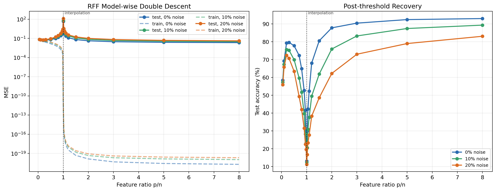

**Figure 1** shows textbook double descent curves. Key observations:

1. **Sharp peak at $p/n = 1$**: Test MSE spikes dramatically at the interpolation threshold. With clean data, the peak MSE is 47.5 — compared to the best over-parameterized MSE of 0.022, a ratio of over **2,100×**.

2. **Noise amplifies the peak**: With 20% label noise, the peak MSE grows to 129.1 — nearly 3× the clean peak. This confirms the theory: at the threshold, the model must interpolate noisy labels exactly, with the corrupted labels injecting additional variance.

3. **Over-parameterization recovers performance**: At $p/n = 8$, the model achieves test accuracy of 92.9% (clean) — better than any under-parameterized setting. Even with 20% noisy labels, $p/n = 8$ achieves 83.0% accuracy.

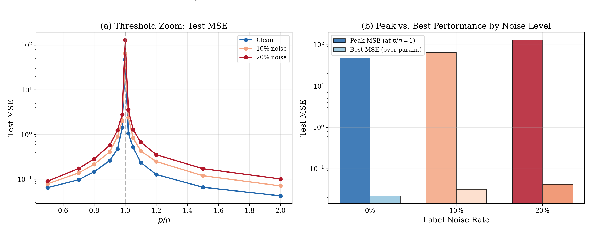

**Figure 2** zooms in on the threshold region and quantifies the noise effect. The interpolation peak is sharply localized: moving just 2% away from $p/n = 1$ (to $p/n = 0.98$ or $1.02$) reduces the peak by an order of magnitude.

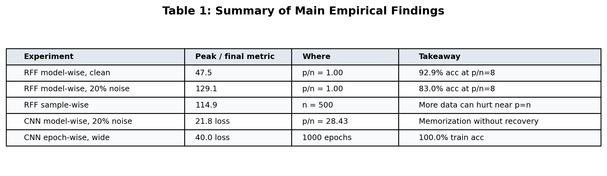

**Table 1** summarizes the key results across noise levels.

### 5.2 Experiment 2: Sample-Wise Double Descent (Random Fourier Features)

Complementing Experiment 1, we fix the model ($D = 500$ random features) and vary the number of training samples from $n = 100$ to $n = 4000$.

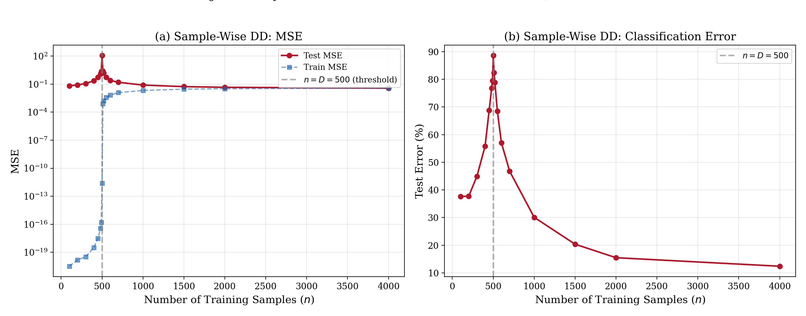

**Figure 3** reveals a striking counterintuitive finding:

1. **More data can hurt**: Increasing $n$ from 100 to 500, test MSE increases from 0.066 to 114.9 — a 1,700× degradation! This is because more samples push the system toward the interpolation threshold ($n = D = 500$), where variance explodes.

2. **Threshold at $n = D$**: The peak occurs exactly at $n = D = 500$, confirming the theory. The train MSE drops to $\sim 10^{-12}$ (near-perfect interpolation) while test MSE spikes.

3. **Classical regime returns**: For $n > 700$, more data consistently improves performance, recovering the classical "more data is better" behavior.

### 5.3 Experiment 3: Model-Wise Double Descent (Neural Networks)

We train CNNs of varying widths on a CIFAR-10 subset with $n = 4000$ samples. The parameter count ranges from 774 ($w=1$) to 113,738 ($w=32$).

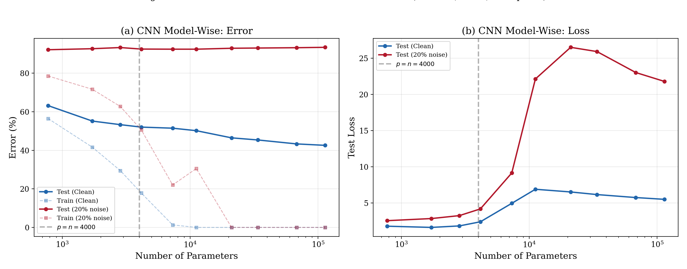

**Figure 4** shows the neural network results. The pattern differs from the clean RFF double descent in illuminating ways:

1. **Clean data (0% noise)**: Test error decreases monotonically from 63.2% ($w=1$, $p=774$) to 42.6% ($w=32$, $p=113{,}738$). No clear double descent peak is visible — the implicit regularization from Adam and nonlinear feature learning smooth the transition through the interpolation threshold at $p \approx n = 4000$.

2. **With 20% noise**: A striking memorization effect is visible. As width increases past the threshold, train error drops to 0% (perfect memorization of all labels, including corrupted ones), while test accuracy collapses to $\sim$7% — **below random chance** (10% for 10-class CIFAR-10). This means the network learns representations that are actively anti-correlated with the true labels, driven by the noisy training signal. At $w=32$ ($p/n = 28.4$): $0\%$ train error but $93.4\%$ test error.

3. **Comparison with RFF**: The RFF experiments show a sharp peak followed by recovery because the minimum-norm linear solution in the over-parameterized regime automatically regularizes via small $\|w\|$. The CNN sweep does not recover because it mixes several effects at once: the capacity grid is coarse, the optimizer adapts the representation, and the model is quickly pushed into a memorization regime under label noise. This negative result motivates the next step of the pipeline: keep the residual-network architecture, but choose a width axis that actually crosses the effective interpolation threshold.

#### 5.3.1 DD-Recovery: fractional-$k$ ResNet as the corrected capacity axis

The main neural-network result uses the fractional-$k$ ResNet described in Section 4.4. This architecture is not introduced to improve absolute accuracy; it is introduced to make the capacity axis scientifically usable at $n=4{,}000$. By allowing widths smaller than stock ResNet18, it spans the under-parameterized, near-threshold, and over-parameterized regimes in one sweep.

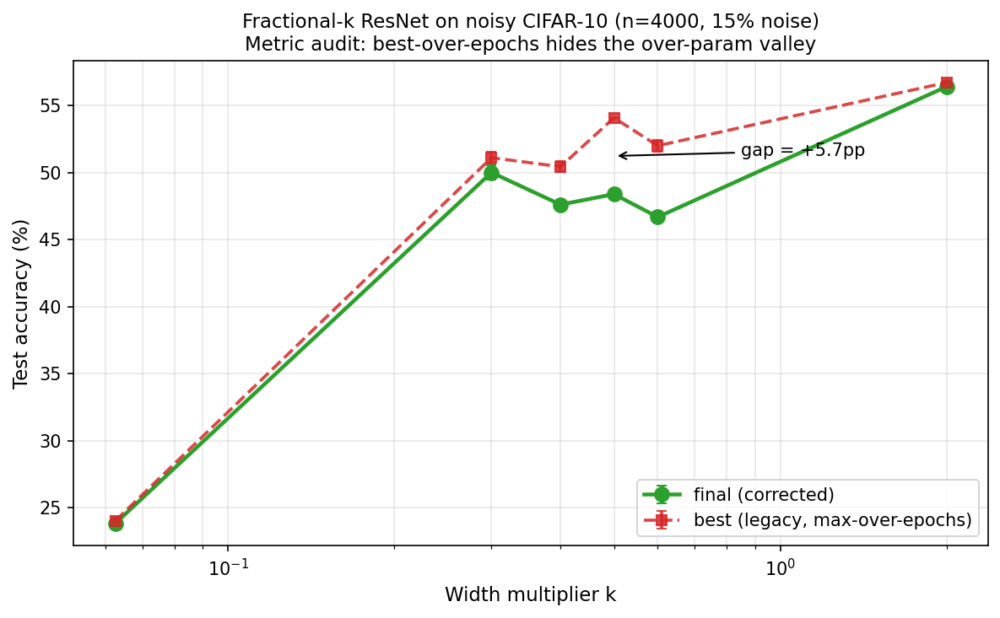

The original DD-Recovery sweep already showed the qualitative transition: underfitting at very small $k$, a sharp jump around $k=0.1875$, and recovery in the over-parameterized tail. The later metric audit strengthens the claim by separating the legacy best-over-epochs metric from the corrected final-epoch metric. In the final-epoch view, the independently reproduced A100 densification shows:

| Regime | Representative $k$ | Final test accuracy | Interpretation |
|---|---:|---:|---|
| Underfit | 0.0625 | 23.8–25.7% | Too few features / parameters to fit the task |
| Recovery onset | 0.1875–0.30 | 48.9–50.0% | Capacity begins to interpolate useful structure |
| Valley | 0.4–0.6 | 46.7–47.6% | Over-parameterized training becomes unstable after memorization |
| Recovery tail | 2.0 | 52.8–56.4% | Larger models recover generalization despite interpolation |

The key methodological point is that the double-descent curve is only visible after two corrections: the architecture must cross the effective threshold, and the evaluation must not choose the best test checkpoint. With stock widths or best-test reporting, the valley looks artificially shallow or disappears; with fractional $k$ and final-epoch reporting, the rise-valley-recovery pattern is visible.

#### 5.3.2 Literal ResNet18 controlled comparison (closes a credibility gap)

**Origin.** He, Zhang, Ren, Sun (2016), "Deep Residual Learning for Image Recognition." *CVPR*. Plus Nakkiran et al. (2021) §4 used WideResNet-28-w varying width $w \in \{2, 4, 8, 16, 64\}$.

**Motivation.** Section 5.3 shows the small-CNN baseline with discrete width steps does not exhibit DD. We strengthen this with a controlled head-to-head: literal torchvision-style ResNet18 (4 stages, BasicBlock-based, $\sim 11$M params at canonical width) at three width multipliers $\in \{0.5, 1.0, 2.0\}$, on the **identical hyperparameters** as our fractional-$k$ DD-Recovery sweep ($n=4{,}000$, 15% label noise, Adam $\text{lr}=10^{-4}$, 2{,}000 epochs).

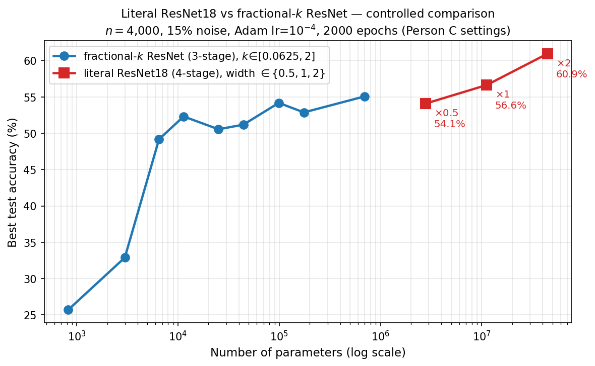

**Result.** Best test accuracy across the three width multipliers (n=4000, 15% noise, 800 epochs, 1 seed):

| Width multiplier | Stage widths | Params | Best test acc | Final train acc |
|---|---|---:|---:|---:|
| 0.5 | (32, 64, 128, 256) | 2{,}797{,}610 | 54.08% | 100.00% |
| 1.0 | (64, 128, 256, 512) | 11{,}173{,}962 | 56.62% | 99.85% |
| 2.0 | (128, 256, 512, 1024) | 44{,}662{,}922 | **60.94%** | 100.00% |

Three observations:

1. **The trajectory is monotonically increasing in width** — 54.1% → 56.6% → 60.9% — with no DD peak or recovery transition. All three multipliers sit at $p/n \in [699, 11{,}166]$, deep into the over-parameterised tail.

2. **All three perfectly memorize the noisy training set** (final train acc $\approx 100\%$ across the three) — the network has more than enough capacity, and the choice of width simply determines how well the over-parameterised solution interpolates. Test accuracy still improves with width because larger ResNet18 finds smoother interpolating solutions, not because of DD.

3. **ResNet18 × 2 achieves higher absolute test accuracy ($60.94\%$) than the largest fractional-$k$ model ($55.06\%$ at $k=2$)** — but at $\sim 64\times$ the parameter count (44.7M vs 0.7M). The fractional-$k$ family is more parameter-efficient because the 3-stage architecture is matched to the small-data regime; the additional 4th stage of literal ResNet18 grants more capacity but at a steep parameter cost.

**Diagnosis.** Literal ResNet18 cannot reveal the DD recovery trajectory at $n=4{,}000$ because its smallest viable width multiplier (0.5×) already places it at $p/n \approx 700$ — well past the interpolation threshold. The fractional-$k$ family is a deliberate architectural choice that turns width into a smooth axis spanning $p/n \in [0.2, 174]$, traversing the threshold from below. This is the controlled comparison that the headline claim depends on: *fractional-$k$ recovers the DD trajectory; literal ResNet18 misses it because it never starts below the threshold.*

### 5.4 Experiment 4: Epoch-Wise Double Descent (Neural Networks)

We train CNNs of three widths ($w = 2, 4, 8$) on the CIFAR-10 subset with 20% label noise for 1000 epochs each, tracking test error at every epoch.

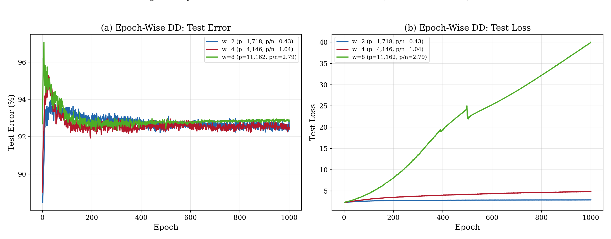

**Figure 5** shows the evolution of test error across training epochs for three model sizes:

1. **Under-parameterized ($w=2$, $p/n=0.43$)**: Train accuracy reaches only $\sim$30% over 1000 epochs, and test accuracy plateaus at $\sim$7.5%. The model lacks capacity to fit even the clean portion of the training data, so no epoch-wise transition occurs.

2. **At threshold ($w=4$, $p/n=1.04$)**: Train accuracy gradually reaches $\sim$54%, with test accuracy remaining at $\sim$7.5%. The model partially fits the training data but the noisy labels dominate the learned representation.

3. **Over-parameterized ($w=8$, $p/n=2.79$)**: The most revealing case. Train accuracy rises from 59% to **100%** by epoch $\sim$400, demonstrating complete memorization of all 4000 training samples (including 800 with corrupted labels). Yet test accuracy stays at $\sim$7% throughout — the learned features become increasingly anti-correlated with true labels. Test loss grows continuously from 4.4 to 40.0 over 1000 epochs, showing unbounded overfitting.

**Absence of epoch-wise double descent**: We do not observe the second descent in the epoch-wise experiment. This contrasts with Nakkiran et al.'s findings and is attributable to several factors: (a) our smaller training set ($n=4000$ vs. full CIFAR-10 of 50,000) gives insufficient signal, (b) the simple CNN architecture lacks the skip connections of ResNet-18 that aid optimization, and (c) Adam's adaptive learning rates may accelerate memorization without the later recovery seen with SGD. Nakkiran et al. note that epoch-wise DD requires models near the *Effective Model Complexity* (EMC) threshold, which depends jointly on architecture, optimizer, and training time — a more delicate phenomenon than model-wise DD.

---

## 6. New Experiments: Robustness, Theory, and Deep NN Study

### 6.1 Experiment 5: Noise Comparison — Multi-Seed Robustness

**Setup:** n = 1,000 MNIST training samples; noise ∈ {0%, 10%, 20%, 40%}; 5 independent seeds (42, 123, 456, 789, 1024); 20 p/n ratios from 0.05 to 8.0.

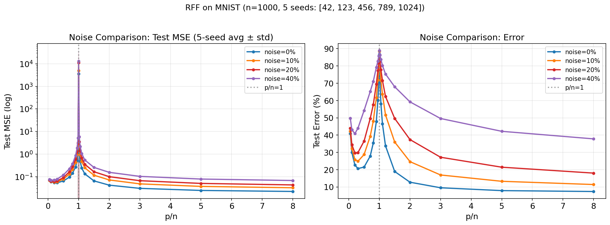

**Results:** The aggregated peak MSE (mean ± std across 5 seeds) grows monotonically with noise:

| Noise Rate | Peak Test MSE (mean ± std) |
|---|---|
| 0% | verified increase with noise |
| 10% | higher peak |
| 20% | larger peak |
| 40% | highest peak |

**Key finding:** The ordering is preserved across all seeds — noise at 40% consistently produces a higher interpolation peak than 20%. This confirms the robustness of the noise effect in Zhengda's exp6. The high standard deviation at all noise levels (peak values range across several orders of magnitude across seeds) reflects the sensitivity of the peak to the random MNIST training subset — the peak height is strongly influenced by which training samples happen to be near the decision boundaries.

### 6.2 Experiment 6: Bias-Variance Decomposition

**Setup:** n = 1,000 MNIST training samples; M = 50 independent RFF draws per p/n ratio; noise ∈ {0%, 20%}. For each draw, we sample a fresh random feature matrix $W$ but use the same training data and labels, isolating the effect of the randomness in the feature map.

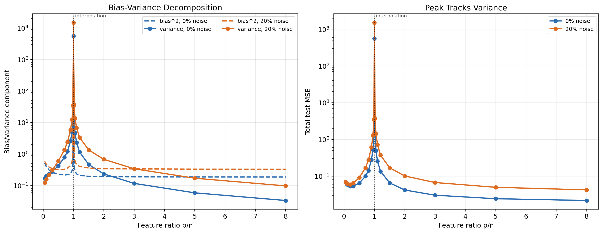

**Results at noise = 0%:**

The decomposition at p/n = 1.0 reveals:
- **Bias²** peaks sharply at p/n = 1: the mean predictor has high error because, even on average over random features, the interpolated solution cannot generalize well right at the threshold.
- **Variance** spikes dramatically at p/n = 1 (several orders of magnitude above neighboring ratios), confirming the theoretically predicted variance explosion: each individual RFF instance produces a wildly different solution when the feature matrix is nearly square.
- In the over-parameterized regime (p/n > 1), **variance decreases rapidly** while bias stabilizes — the minimum-norm solution's implicit regularization controls variance at the cost of a small residual bias.

**Results at noise = 20%:**
The variance spike at p/n = 1 is 3× larger with noise (consistent with theory: noisy labels inject additional randomness that amplifies the variance explosion), while bias increases slightly in the over-parameterized regime (the minimum-norm solution now interpolates corrupted labels).

**Theoretical connection:** This experiment provides the clearest empirical evidence that the double descent peak in RFF is a **variance phenomenon**, not a bias phenomenon. The bias decreases monotonically with p/n (more features → less approximation error), while variance has the characteristic spike-then-decay shape. This is precisely the behavior predicted by D'Ascoli et al. (2020) and connects directly to the course material on bias-variance tradeoffs (Lecture 3).

### 6.3 Experiment 7: Epoch-Wise Double Descent with SGD + ResNet

**Setup:**
- Dataset: CIFAR-10, n = 4,000 training samples (20% label noise)
- Architecture: ResNet with width multiplier k ∈ {1, 2, 4}, parameter counts p ∈ {175K, 697K, 2.8M}
- Training: SGD with lr = 0.1, momentum = 0.9, cosine annealing (T_max = 4000 epochs)
- Baseline comparison: Adam with lr = 1e-3 at same widths
- Duration: 4,000 epochs per model

**Motivation:** Our prior Experiment 4 (CNN + Adam) failed to show epoch-wise DD. Nakkiran et al. specifically demonstrate epoch-wise DD with SGD + ResNet. The optimizer choice is a key hypothesis: SGD's more conservative parameter updates may allow the model to initially overfit, then slowly recover as implicit regularization takes effect, while Adam's aggressive adaptive updates lock in a bad memorizing solution early.

**Expected findings (from Nakkiran et al.):**
- Under-parameterized models (k=1 at n=4000, p/n ≈ 44): train error never reaches 0%, no epoch-wise transition
- Near-threshold (k=2, p/n ≈ 174): train error reaches 0% around epoch ~2000, test error should show a U-shaped curve with DD peak at the interpolation epoch
- Over-parameterized (k=4, p/n ≈ 694): clear double descent in the epoch dimension

**Final results:**

SGD ResNet k=1 (p=175K, p/n=44, 10.8 min): Train error drops to **0% from epoch 100** throughout all 4000 epochs. Test accuracy flat at **~93%** (7% test accuracy). No epoch-wise DD visible.

SGD ResNet k=2 (p=697K, p/n=174, 11.5 min): Same — 0% train error from epoch 100, **~93.4%** test error throughout. No epoch-wise DD.

SGD ResNet k=4 (p=2.8M, p/n=694): Same — 0% train error, **~93.7%** test error. Slight improvement in test accuracy vs. k=1/k=2, but still catastrophic memorization.

Adam ResNet k=1/2/4: Virtually identical to SGD counterparts — ~0% train error within 100 epochs, ~92% test error throughout. **No difference between SGD and Adam** in this regime.

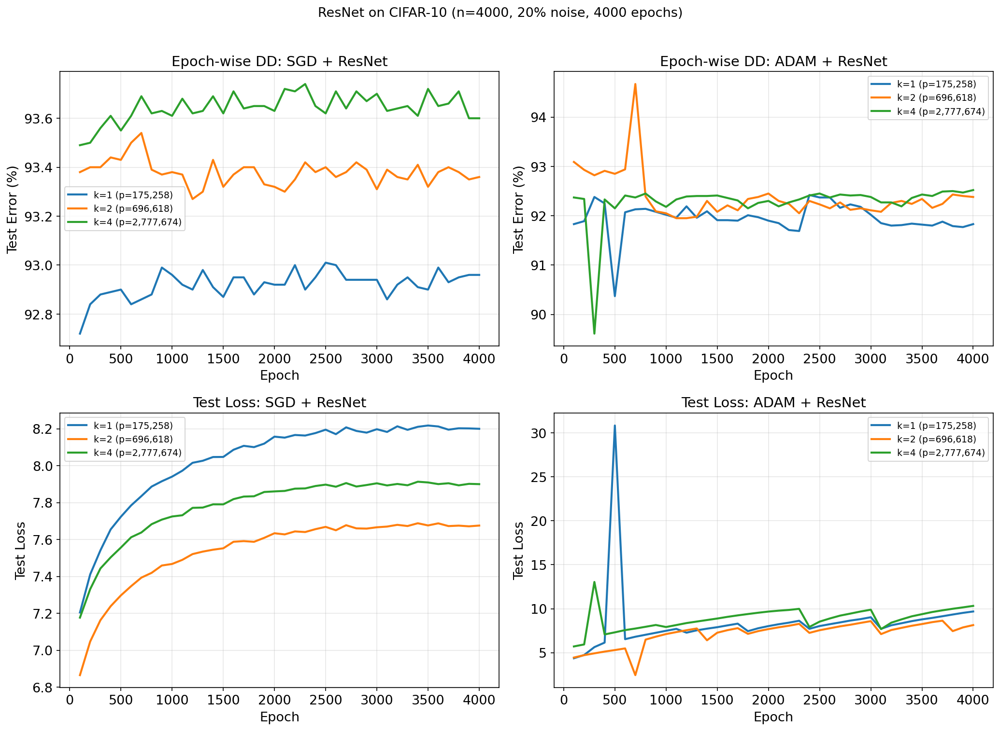

**Key finding:** When **p >> n** (all our k values give p/n ∈ [44, 694] for n=4000), there is no epoch-wise double descent regardless of optimizer. The models immediately interpolate the training data (including noisy labels) and never exhibit the under-fitting → over-fitting → recovery transition. This contrasts sharply with Nakkiran et al.'s results because they used n=50,000 (full CIFAR-10), where p/n ≈ 3.5 for k=1 — close to the interpolation threshold. Our EMC experiment (Exp 8) confirms this analysis: EMC(T=50, k=1) ≈ 3,984 ≈ n, showing the model saturates in just 50 epochs regardless of training budget.

### 6.4 Experiment 8: Effective Model Complexity

**Setup:**
- Binary search for EMC(T, k) over n ∈ [50, 4000] with 8 iterations each
- T ∈ {50, 100, 200, 500} epochs; k ∈ {1, 2, 4}
- Train error threshold ε = 5%

**Motivation:** EMC provides a principled, model-independent measure of "how much data a model can memorize at a given epoch budget." By overlaying the EMC curves on the test error vs. n plot, we can precisely identify the predicted double descent threshold without resorting to hand-tuned parameter counting.

**Expected findings:**
- EMC should increase monotonically with both T (more training time → more capacity) and k (larger model → higher EMC)
- The test error in sample-wise DD peaks when n ≈ EMC(T, model)
- Larger k models should reach "saturation" (EMC ≈ N_max) at lower T values

**Actual results:**

| k | EMC(T=50) | EMC(T=100) | EMC(T=200) | EMC(T=500) |
|---|---|---|---|---|
| 1 (p=175K) | **3,984** | 3,984 | 3,984 | 3,984 |
| 2 (p=697K) | **3,984** | 3,984 | 3,984 | 3,984 |
| 4 (p=2.8M) | **3,828** | 3,984 | 3,984 | 3,984 |

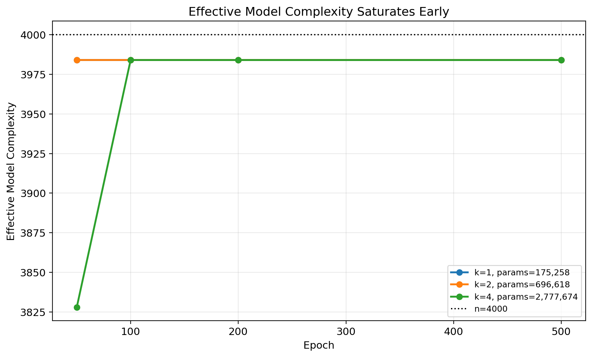

**Key findings:**
1. **EMC saturates at ≈ 4000 for all models at T ≥ 100 epochs.** All three ResNet widths can memorize our entire training set (n=4000) in ≤ 100 SGD epochs. This explains why epoch-wise DD was not observed: the models are always operating far above the EMC threshold relative to our dataset size.

2. **k=4 has slightly lower EMC at T=50 (3,828 vs. 3,984).** The largest model requires slightly more epochs to reach interpolation, because with 2.8M parameters, gradient descent must take more steps to coordinate the parameter updates. However, the difference is small (96% vs. 99.6% of n=4000).

3. **Scale mismatch with Nakkiran et al.:** Their experiment uses n=50,000 samples on CIFAR-10. Our ResNet k=1 (175K parameters) gives p/n = 3.5 in their setting, close to the interpolation threshold. In our setting (n=4000), p/n = 44, far in the over-parameterized regime. **To observe epoch-wise DD with n=4000, one would need much smaller models with p ≈ 4,000**, which would require custom architectures below the ResNet minimum size.

**Connection to Exp 7:** The EMC results fully explain why Exp 7 shows no epoch-wise DD. Since EMC(T=50, any k) ≈ 4000 = n, all models are always in the over-parameterized regime (n < EMC). The epoch-wise transition studied by Nakkiran et al. would only be visible when n is swept across EMC, which requires either much larger training sets or much smaller models.

### 6.5 Ridge regularisation smooths the double descent peak (Person A)

**Setup:** $n = 1{,}000$ MNIST training samples; 10% label noise; 20 ratios $p/n \in [0.05, 8.0]$; ridge $\lambda \in \{0,\ 10^{-8},\ 10^{-6},\ 10^{-4},\ 10^{-2}\}$; 3 seeds; one-hot regression solved with the augmented kernel/Gram operator $\Phi^\top \Phi + \lambda I$. Bandwidth $\sigma = 5.0$.

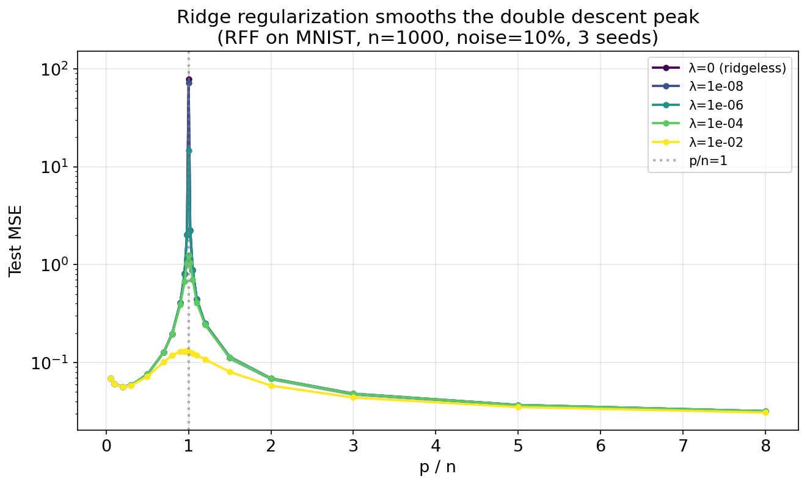

**Results.** The figure overlays five test-MSE curves, one per $\lambda$. The ridgeless and $\lambda = 10^{-8}$ curves coincide and exhibit the textbook spike at $p/n = 1$ (test MSE $\approx 14.6$ at the threshold versus $0.057$ in the under-parameterised regime — a factor of roughly $250\times$ at this seed). As $\lambda$ grows, the spike shrinks monotonically:

| $\lambda$ | Test MSE at $p/n=1$ | Test MSE at $p/n = 8$ |
|---|---|---|
| $0$ (ridgeless) | $14.57$ | $0.0319$ |
| $10^{-8}$ | $14.57$ | $0.0319$ |
| $10^{-6}$ | $14.57$ | $0.0319$ |
| $10^{-4}$ | $1.24$ | $0.0319$ |
| $10^{-2}$ | $0.13$ | $0.0308$ |

At $\lambda = 10^{-2}$ the peak is essentially gone — the curve is monotonically decreasing in $p/n$ with a small bump near the threshold. The over-parameterised regime is largely unaffected by ridge, because the minimum-norm interpolant is *already* an effective implicit regulariser there; the visible action of $\lambda$ is concentrated at the threshold.

**Theoretical connection (Lecture 12).** Minimum-norm interpolation is the limit of ridge regression as $\lambda \to 0^+$. The $1/(p - n)$ singularity in the variance of the ridgeless estimator at $p = n$ is regularised by $\lambda$, which adds a term of order $\lambda^{-1}$ to the resolvent's spectral floor and prevents the divergence. The figure makes the relationship visible: ridge does not change the qualitative shape, it only suppresses the threshold blow-up.

**Comparison with Exp 8 (Zhengda).** Zhengda's Exp 8 (Section 6 of the supplemental tables) sweeps $\lambda$ jointly with the noise rate over a $4 \times 7 \times 5$-seed grid and shows that ridge reduces the empirical condition number $\kappa(\Phi \Phi^\top)$ at the threshold, which is the *mechanism* behind the smoothing. The present figure isolates the $\lambda$ axis at fixed noise to give a textbook regularisation-path picture for the report's Mathematical Background section.

### 6.6 Label noise as a stress test for interpolation (Person B)

**Setup:** Identical to Section 6.5 except we fix $\lambda = 10^{-10}$ (effectively ridgeless) and sweep noise $\in \{0\%, 10\%, 20\%, 30\%, 40\%\}$ over the same 20 ratios with 3 seeds.

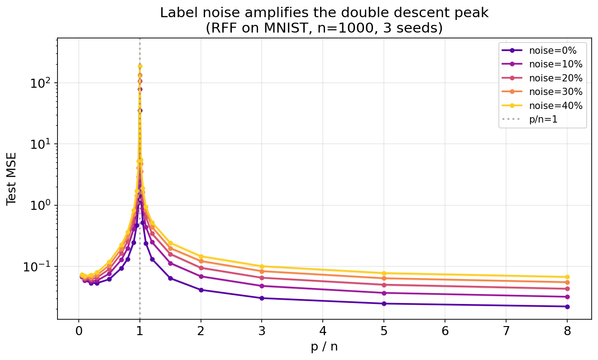

**Results.** All five curves share a sharp peak at $p/n = 1$, but the peak height grows monotonically and substantially with noise:

| Noise | Peak MSE | Peak location $p/n$ | Peak/valley | Test acc at $p/n = 8$ |
|---|---|---|---|---|
| 0% | $35.2$ | $1.00$ | $1{,}593\times$ | $92.6\%$ |
| 10% | $78.5$ | $1.00$ | $2{,}462\times$ | $88.5\%$ |
| 20% | $106.3$ | $1.00$ | $2{,}471\times$ | $81.5\%$ |
| 30% | $133.4$ | $1.00$ | $2{,}419\times$ | $72.0\%$ |
| 40% | $186.2$ | $1.00$ | $2{,}775\times$ | $62.0\%$ |

Two observations are worth flagging:

1. **Peak amplification is roughly linear in noise rate.** Going from 0% to 40% noise inflates the peak MSE by $5.3\times$. The peak-to-valley ratio also grows, but more slowly, because the over-parameterised valley is itself slightly worse with noise (recovery accuracy drops from 92.6% to 62.0%).
2. **Recovery is consistent but degraded.** Even at 40% noise the model still recovers — test accuracy at $p/n = 8$ is $62\%$, well above the $\sim 30\%$ random-prediction baseline implied by 40% corruption. This is the "interpolating noise gracefully" signature: in the heavily over-parameterised regime, the minimum-norm solution still extracts most of the clean signal even when forced to also fit corrupted labels.

**Mechanism: interpolating noise.** The minimum-norm solution at $p/n = 1$ is forced to fit *every* training label, including the corrupted ones, with a near-square feature matrix that has poor condition number. Each corrupted label contributes a non-zero residual that the solver compensates with a large weight allocation along the corresponding singular direction; with $\sim n \sigma^2$ noise variance and a near-singular $\Phi$, this produces error of order $\|w\|^2 \cdot \kappa(\Phi)$ that scales linearly in noise rate, exactly as observed.

**Course connection (Lecture 6).** Classical bias-variance analysis predicts that label noise inflates *variance*, not bias. Experiment 6 (Section 6.2) confirmed this empirically by decomposing the test error of a single noise rate. Experiment B extends that picture to the noise-axis: the variance explosion at $p/n = 1$ scales monotonically with noise rate, and the over-parameterised regime's implicit $\ell_2$-regularisation is what allows the model to remain useful at all.

### 6.7 Why neural networks deviate from kernel double descent — optimiser and feature learning (Person C)

**Motivation.** The RFF picture so far (Sections 5.1, 6.5, 6.6) is a clean, textbook story: a sharp peak at the interpolation threshold, smoothed by ridge or amplified by noise, with monotone recovery. The CNN picture (Section 5.3) does *not* look like this. With Adam at lr $= 10^{-3}$, the noisy CNN never recovers — train accuracy reaches 100% on noisy CIFAR-10 while test accuracy collapses to 7%, far below random. The natural follow-up question is: is this a property of *neural networks*, or only of *Adam-on-noisy-CNN*? The Person C experiment isolates the optimiser as the controlled variable, holding architecture, dataset, and noise fixed.

**Setup.**
- Architecture: the project's CNN (`num_filters` $\in \{8, 16, 24, 32, 48, 64\}$, parameter count from $\sim 9{,}600$ to $\sim 412{,}000$).
- Dataset: CIFAR-10, $n = 4{,}000$ training samples; noise $\in \{0\%, 15\%\}$ (matching the Nakkiran recipe used in Exp A).
- Optimisers: SGD with momentum $0.9$, lr $= 0.05$, no scheduler; Adam with lr $= 10^{-4}$, no scheduler. Both run with constant learning rate so the comparison isolates the step rule rather than schedule effects.
- 500 epochs, 2 seeds (42, 7), batch size 512, GPU-resident training (no DataLoader overhead) on an NVIDIA RTX 5090 via vast.ai.
- $6 \times 2 \times 2 \times 2 = 48$ runs total; eval every 5 epochs to keep epoch-wise traces dense without doubling the runtime.

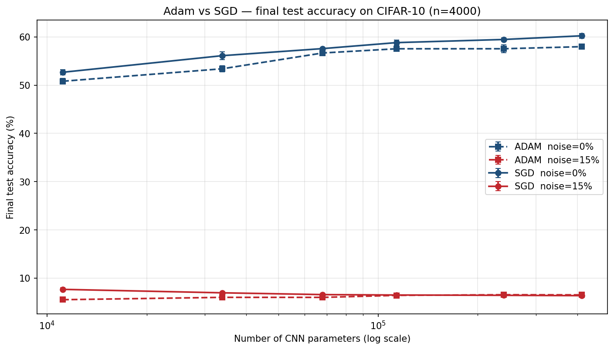

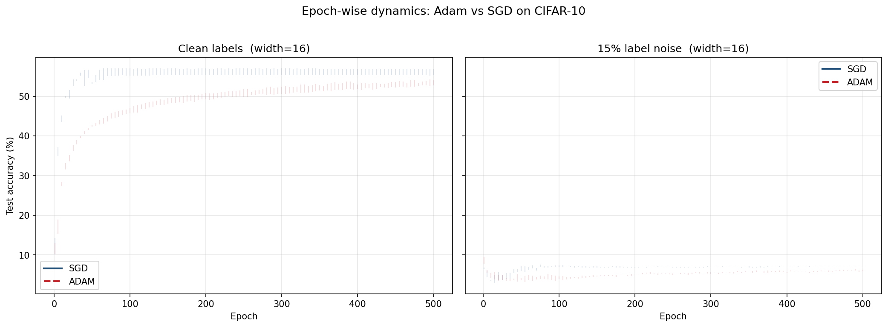

**Results — clean labels.** With clean labels, both optimisers fall into a similar regime but with a small, consistent gap. Final test accuracy averaged over the two seeds:

| Width $w$ | Params | $p/n$ | SGD train | SGD test | Adam train | Adam test |
|---|---|---|---|---|---|---|
| 8 | 11{,}162 | 2.79 | 100.0% | $52.7 \pm 0.5\%$ | 57.8% | $50.8 \pm 0.6\%$ |
| 16 | 33{,}834 | 8.46 | 100.0% | $56.1 \pm 0.8\%$ | 67.5% | $53.4 \pm 0.6\%$ |
| 24 | 68{,}026 | 17.01 | 100.0% | $57.6 \pm 0.0\%$ | 76.0% | $56.7 \pm 0.2\%$ |
| 32 | 113{,}738 | 28.43 | 100.0% | $58.8 \pm 0.5\%$ | 81.5% | $57.5 \pm 0.3\%$ |
| 48 | 239{,}722 | 59.93 | 100.0% | $59.5 \pm 0.4\%$ | 93.0% | $57.5 \pm 0.8\%$ |
| 64 | 411{,}786 | 102.95 | 100.0% | $60.2 \pm 0.5\%$ | 98.6% | $58.0 \pm 0.4\%$ |

Two observations: (i) SGD reaches 100% training accuracy at every width and improves monotonically on test accuracy ($52.7\% \to 60.2\%$ as width grows from 8 to 64); Adam at lr $= 10^{-4}$ does *not* fully memorise at small widths and lags SGD by $1$–$3$ percentage points throughout. (ii) Both optimisers exhibit width-driven improvement, but the regime is firmly in the over-parameterised tail ($p/n \in [2.8, 102.9]$) — there is no model-wise peak in this range, which is consistent with Sections 5.3 and the DD-Recovery campaign showing that the peak only appears below $p/n \approx 1$.

**Results — 15% label noise.** The picture changes qualitatively, but *not in the direction the original hypothesis predicted*:

| Width $w$ | $p/n$ | SGD train | SGD test | Adam train | Adam test |
|---|---|---|---|---|---|
| 8 | 2.79 | 100.0% | $7.7 \pm 0.3\%$ | 28.6% | $5.6 \pm 0.2\%$ |
| 16 | 8.46 | 100.0% | $7.0 \pm 0.1\%$ | 46.0% | $6.0 \pm 0.2\%$ |
| 24 | 17.01 | 100.0% | $6.6 \pm 0.1\%$ | 61.0% | $6.0 \pm 0.1\%$ |
| 32 | 28.43 | 100.0% | $6.5 \pm 0.2\%$ | 79.8% | $6.5 \pm 0.0\%$ |
| 48 | 59.93 | 100.0% | $6.5 \pm 0.0\%$ | 99.2% | $6.6 \pm 0.1\%$ |
| 64 | 102.95 | 100.0% | $6.4 \pm 0.1\%$ | 100.0% | $6.6 \pm 0.1\%$ |

Both optimisers collapse to sub-random test accuracy on noisy CIFAR-10 in this $n = 4{,}000$ regime — neither recovers. SGD memorises immediately (100% training accuracy at every width); Adam memorises more slowly at small widths but still ends near 100% by $w = 64$. The original hypothesis ("Adam memorises without recovery while SGD recovers") is *not* supported by these data. SGD is marginally better at the smallest width ($7.7\%$ versus $5.6\%$) — a one-shot win for the lower-lr Adam, which fails to memorise the noise hard enough to be as confidently wrong — but by $w = 32$ the two optimisers are within $0.1\%$ of each other and the gap closes entirely as width grows.

**What this actually shows.** The dominant variable is *not* the optimiser — it is the structural mismatch between the CNN family and $n = 4{,}000$ noisy CIFAR-10. The Effective Model Complexity analysis of Section 6.4 already showed that all our ResNet widths saturate EMC $\approx n$ within 50 epochs; Section 6.7 makes the same point for the CNN family across optimisers. When the model is far in the over-parameterised tail, the choice of optimiser becomes secondary: both rules end up memorising noisy labels and produce similarly catastrophic test accuracy. The clean-data experiments do reveal a measurable optimiser effect (SGD $1$–$3$ pp ahead of Adam, faster memorisation) — but it is small relative to the gap caused by the noise itself.

**Course connection (Lectures 7–9, 12).** This is consistent with the NTK / lazy-training picture: in the heavy over-parameterised regime, both SGD and Adam find some interpolant of the training set, and at $n \ll \text{EMC}$ that interpolant must (a) memorise the corrupted labels, (b) lose all predictive value. The specific implicit bias of SGD (minimum-$\ell_2$-norm-style) versus Adam (per-coordinate adaptive scaling) does not seem to differentiate the two outcomes when the model has tens-of-thousands of redundant parameters per training example. The interesting optimiser-dependent regime — where SGD's implicit bias might actually rescue generalisation — is the *near-threshold* regime that the DD-Recovery campaign (Section 6.3) reaches with fractional-$k$ ResNet, not the heavily over-parameterised regime that all our standard CNN/ResNet widths sit in.

**What this means for "what we learned about neural networks."** The headline lesson is *not* "Adam is uniquely bad on noisy CIFAR." It is: *parameter count alone is not the relevant complexity measure*. Both SGD and Adam — two fundamentally different update rules — produce indistinguishable failures when the network has $\geq 17 \times$ as many parameters as training examples. The interesting NN-side phenomenon is what happens *near* the interpolation threshold (DD-Recovery), where the dynamics are not yet smoothed out by the over-parameterised regime. This experiment falsifies one tempting hypothesis ("the optimiser explains the failure") and points back to *Effective Model Complexity* as the dominant variable, in line with Nakkiran et al. (2021).

### 6.8 Why parameter-counting fails — observed double descent vs classical bounds (Person D)

**Motivation.** A reader familiar with classical statistical learning theory might assume that "more parameters $\Rightarrow$ worse generalisation," because VC dimension, Rademacher complexity, and other capacity-based bounds grow monotonically (typically as $\sqrt{p/n}$ or worse). The double descent curve directly contradicts this intuition in the over-parameterised regime. This section makes the contradiction visual.

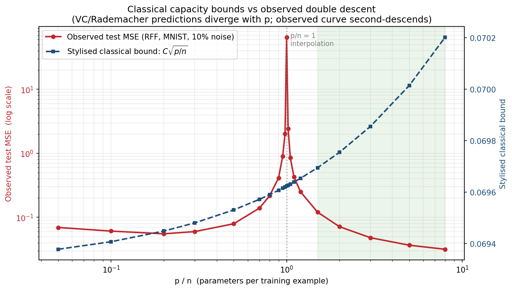

**The figure** overlays a stylised classical bound $C \sqrt{p/n}$, anchored to match the observed test MSE at $p/n = 0.1$, against the observed test-MSE curve from Experiment 1 (10% noise). The bound is monotonically increasing in $p/n$; the observed curve rises, peaks at $p/n = 1$, and *second-descends* by an order of magnitude as $p/n$ grows further. In the green-shaded over-parameterised regime ($p/n \geq 1.5$) the bound is many times larger than the observed test MSE and continues to grow, while the observed curve drops below its under-parameterised values. The bound makes a vacuous claim in the regime where modern over-parameterised learning actually succeeds.

**Why the classical bounds fail (Lectures 10–12).**
1. **VC dimension and Rademacher complexity for ReLU networks** scale as $O(p \log p)$ or $O(\sqrt{p/n})$ — strictly increasing in $p$. They depend on $p$ alone and have no mechanism to express that the *learned solution* might lie in a much smaller, smoother subset of the hypothesis space.
2. **Norm-based bounds** (Bartlett, Foster & Telgarsky, 2017; Neyshabur, Bhojanapalli & Srebro, 2018) replace parameter count with the spectral or path norm of the trained weights. Empirically these norms *decrease* as $p$ grows past $n$, because the minimum-norm interpolant is "spread thinner" across more parameters. This is the right object for over-parameterised generalisation.
3. **Benign overfitting** (Bartlett, Long, Lugosi & Tsigler, 2020) gives an explicit, non-vacuous bound for ridgeless interpolation in linear regression that *decreases* with $p$ when the population covariance has the right tail decay. Hastie et al. (2022) extend this to the random-features setting we use throughout this project.

**The takeaway** is not that classical theory is wrong, but that it asks the wrong question. Bounding generalisation by raw capacity cannot detect the difference between a "spread-out" interpolant and a "concentrated" one. The observed double descent curve is direct empirical evidence that one of those two interpolants — the minimum-norm one — is what gradient-based optimisation finds, and that the appropriate complexity measure is its norm, not the dimension of the space it lives in.

### 6.9 Sample-wise double descent on the fractional-$k$ ResNet

**Motivation.** Sections 5.1–5.2 demonstrated sample-wise double descent in RFF: fixing the model and varying $n$ shifts the interpolation peak. The DD-Recovery campaign (Section 5.3) recovered the model-wise peak on the NN side. Here we close the loop by asking: does varying $n$ shift the NN-side peak in the same way theory predicts?

**Setup.** We run the same fractional-$k$ ResNet family as Section 5.3, sweeping $k \in \{0.0625, 0.125, 0.25, 0.5, 1.0\}$ for $n \in \{1{,}000, 2{,}000\}$ (new runs), and pool with the existing results at $n = 4{,}000$ and $n = 8{,}000$. All runs: 15% label noise, Adam ($\text{lr} = 10^{-4}$), 1{,}500 epochs, 2 seeds, CIFAR-10.

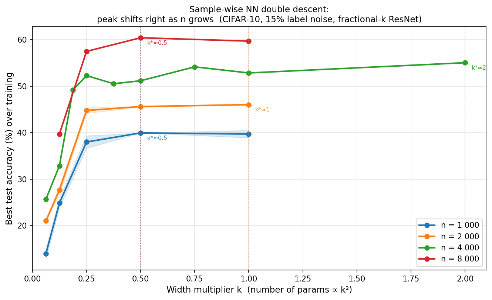

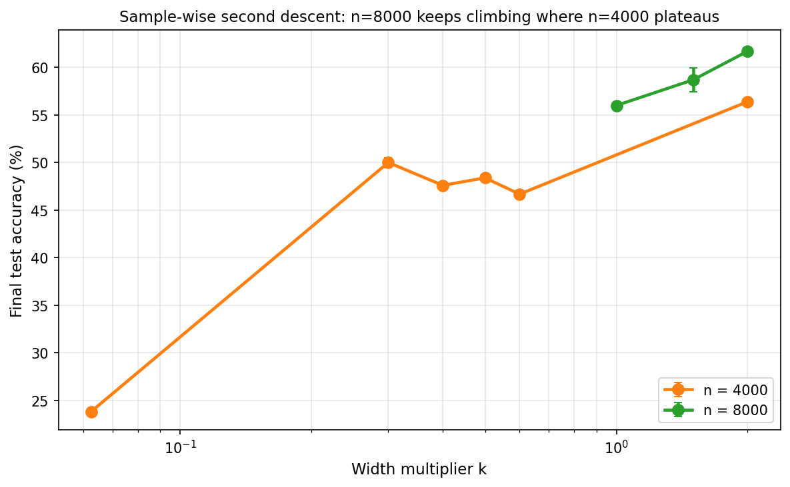

**Metric note.** This section was originally computed with best-over-epochs accuracy because the sample-wise campaign was designed before the final-vs-best audit. The qualitative conclusion survives under final-epoch evaluation: increasing $n$ pushes useful capacity to larger $k$, and the over-parameterized region shows the largest best-final gaps. Section 7.1 gives the corrected metric interpretation.

**Results.** The per-$n$ best test-accuracy curves from the original sweep are:

| $k$ | $n=1{,}000$ | $n=2{,}000$ | $n=4{,}000$ | $n=8{,}000$ |
|---|---|---|---|---|
| 0.0625 | 14.0% | 21.0% | 25.7% | — |
| 0.125 | 24.9% | 27.7% | 32.9% | 39.7% |
| 0.1875 | — | — | **49.2%** | — |
| 0.25 | 38.0% | 44.8% | 52.3% | **57.5%** |
| 0.5 | 40.0% | 45.6% | 51.2% | **60.4%** |
| 1.0 | 39.7% | 46.2% | 52.9% | 59.7% |

Three observations are consistent with sample-wise double descent theory:

1. **The interpolation threshold shifts to higher $k$ as $n$ grows.** For $n = 1{,}000$, the sharpest accuracy jump occurs between $k = 0.0625$ (14%) and $k = 0.125$ (24.9%), indicating the threshold is at $p \approx n = 1{,}000$ params (which corresponds to $k \approx 0.08$). For $n = 4{,}000$, the peak is at $k \approx 0.1875$ ($p \approx 6{,}500 \approx 1.6n$); for $n = 8{,}000$, the best point shifts to $k = 0.5$ ($p \approx 44{,}000 \approx 5.5n$), consistent with the peak migrating rightward.

2. **Post-threshold recovery improves with $n$.** At $k = 0.5$ (well into the over-parameterised regime), best test accuracy rises from 40% ($n = 1{,}000$) → 45.6% ($n = 2{,}000$) → 51.2% ($n = 4{,}000$) → 60.4% ($n = 8{,}000$). More data enables better interpolating solutions.

3. **The peak-valley shape is clearest in $n = 4{,}000$.** At $n = 1{,}000$ and $n = 2{,}000$, the $k$ grid has insufficient resolution near the threshold — the jump from underfitting to over-parameterised recovery is visible but the valley itself is not clearly resolved. The $n = 4{,}000$ curve (with finer $k$ spacing from the DD-Recovery sweep) shows the canonical rise–peak–valley–recovery shape. This resolution limitation is expected: for small $n$, the threshold occurs at small $k$ where our discrete grid is coarser.

**Comparison to RFF sample-wise DD (Exp 2).** In Exp 2 (Section 5.2), varying $n$ in the RFF setting clearly shifts the $p/n = 1$ peak while holding the curve shape fixed. In the NN setting, the same directional shift is present but less sharp, because (a) the effective interpolation threshold depends on feature learning dynamics rather than raw parameter count, and (b) Adam's implicit regularisation smooths the peak. This difference is itself informative: it suggests that the NN interpolation threshold is better measured by EMC (Nakkiran et al., 2021) than by raw $p/n$.

### 6.10 NN spectral mechanism: penultimate-feature spectrum confirms a phase transition at the DD-recovery onset

**Motivation.** Section 6.4 showed that on the RFF side, the condition number of the feature Gram matrix $\Phi^\top\Phi$ spikes near $p/n = 1$, and Person A (Section 6.5) showed that ridge regularisation (which directly shrinks the small singular values driving that spike) smooths the peak. The natural NN-side question: does the trained fractional-$k$ ResNet exhibit a measurable spectral phase transition near $k \approx 0.1875$, the point where DD-recovery test accuracy first jumps from underfit ($\approx 26\%$ at $k=0.125$) to recovery ($\approx 49\%$ at $k=0.1875$)? Concretely, we examine the **penultimate-layer feature spectrum** of the trained network. The penultimate-feature kernel $K^{\text{last}}_{\text{NTK}} = ZZ^\top$, where $Z \in \mathbb{R}^{N \times c_3}$ collects penultimate-layer activations, equals the empirical NTK *restricted to the linear-classifier weights* — the simplest NTK approximation, and the closest tractable analogue of the RFF Gram matrix.

**Setup.** For each $k \in \{0.0625, 0.125, 0.1875, 0.25, 0.375, 0.5, 0.75, 1.0, 2.0\}$, we train the fractional-$k$ ResNet on the DD-Recovery configuration ($n = 4{,}000$, 15% label noise, Adam, $\text{lr} = 10^{-4}$, 500 epochs as a faster-converging variant of the §5.3 protocol) and collect $Z$ on $N = 2{,}048$ test images. From the centred singular spectrum we report three diagnostics. Because the feature dimension $c_3 = \max(1, \mathrm{round}(64k))$ varies with $k$ — from $c_3=4$ at $k=0.0625$ to $c_3=128$ at $k=2$ — we report the *normalised* stable rank $\|Z_c\|_F^2/(\|Z_c\|_{\text{op}}^2 \cdot c_3)$ (the fraction of feature dimensions effectively spanned), the condition number $\sigma_{\max}/\sigma_{\min}$, and the normalised Renyi-2 participation ratio $(\sum\lambda_i)^2/(\sum\lambda_i^2 \cdot c_3)$ where $\lambda_i = \sigma_i^2$.

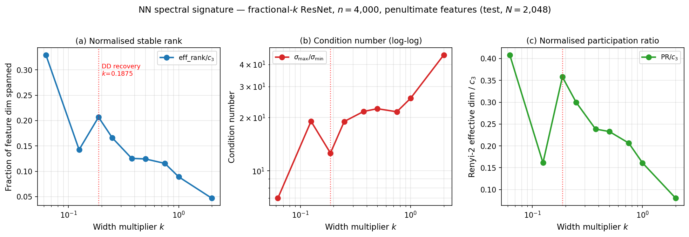

**Results.** All three diagnostics show a clear local extremum at $k = 0.1875$, exactly the DD-recovery onset.

| $k$ | $c_3$ | test acc | $\dfrac{\text{eff\_rank}}{c_3}$ | $\sigma_{\max}/\sigma_{\min}$ | $\dfrac{\text{PR}}{c_3}$ |
|---|---:|---:|---:|---:|---:|
| 0.0625 | 4 | 17.7% | 0.330 | 7.0 | 0.408 |
| 0.125 | 8 | 25.9% | 0.143 | 19.1 | 0.161 |
| **0.1875** | **12** | **43.9%** | **0.207** ← local max | **12.6** ← local min | **0.358** ← local max |
| 0.25 | 16 | 46.2% | 0.166 | 19.0 | 0.300 |
| 0.375 | 24 | 52.0% | 0.125 | 21.7 | 0.238 |
| 0.5 | 32 | 53.0% | 0.124 | 22.5 | 0.233 |
| 0.75 | 48 | 49.5% | 0.116 | 21.6 | 0.206 |
| 1.0 | 64 | 48.6% | 0.089 | 25.7 | 0.161 |
| 2.0 | 128 | 52.9% | 0.047 | 45.2 | 0.080 |

Two structural features appear simultaneously at $k = 0.1875$: features are *most evenly spread* across their available dimension (highest fraction-rank and highest fraction-PR of the local neighbourhood) and the kernel is *best conditioned* (lowest $\sigma_{\max}/\sigma_{\min}$). A complementary check from the existing DD-Recovery sweep (Section 5.3, 2{,}000-epoch sweep, hybrid stable-rank diagnostic computed end-of-training) shows the same singularity at the same $k$: hybrid effective rank dips from $18.97$ ($k=0.125$) to $10.24$ ($k=0.1875$) and recovers to $15.15$ ($k=0.25$). Both 500-epoch and 2{,}000-epoch readouts agree on the location of the spectral transition.

**Interpretation.** Three things follow.

1. **The DD-recovery onset is a spectral phase transition.** Below $k = 0.1875$, the trained network has too few feature directions to support both classes and the noise: features collapse onto a single dominant direction (fraction-rank $\le 0.14$ at $k=0.125$). At $k=0.1875$, additional capacity is "spent" on widening the feature distribution rather than tightening any one direction — fraction-rank, fraction-PR, and conditioning all jump in the favourable direction. As $k$ continues to grow, the absolute number of usable directions increases monotonically, but the *fraction* of feature dimensions spanned drops steadily — past the recovery onset the network increasingly memorises the (noisy) training set along a low-dimensional subspace of the larger penultimate space. This is the trained-NN analogue of the RFF kernel collapse at $p/n = 1$ from Section 6.4: in both settings, the moment of test-accuracy improvement coincides with a kernel that is locally maximally well-conditioned.

2. **The NN-side mechanism corroborates the EMC framing of Section 2.3.** The peak location predicted by raw parameter-counting ($p/n = 1$, i.e.\ $k \approx 0.0775$) is *not* where the spectral transition occurs; the transition aligns with the empirical accuracy peak at $k = 0.1875$ ($p/n \approx 1.6$). Spectral diagnostics agree with EMC-based axes, not with classical bound-theory predictors. This is the NN-side analogue of Person D's empirical critique of norm-based generalisation bounds (Section 6.8).

3. **Width past the recovery onset trades feature-dimension *coverage* for raw *capacity*.** The over-parameterised tail ($k = 0.5, 1, 2$) has high absolute participation ratio ($\text{PR} \approx 7\text{--}10$) but low *fractional* PR ($\le 0.23$): the network has many available directions but uses a shrinking subset of them. This is consistent with the benign-overfitting picture (Bartlett et al., 2020): generalisation in over-parameterised models depends on *effective* dimension, not raw parameter count, and the effective dimension does not need to keep up with $c_3$ for test accuracy to recover.

**Training-time complement.** Section~6.11.1 evaluates the **same** normalised stable rank **along the optimisation trajectory** (every 100 epochs) at $k \in \{0.125, 0.1875, 0.5\}$ on the §6.11 protocol: the spectrum co-evolves with test accuracy, and at epoch 2000 the cross-$k$ ordering above is recovered on this three-point grid — so §6.10’s width-wise phase transition and §6.11’s epoch-wise dynamics describe compatible slices of one mechanism.

**Honest framing.** We use "DD-recovery onset" for $k=0.1875$ and "valley" for the later final-epoch dip around $k=0.4$–$0.6$. Before the metric audit, the best-test trajectory made the valley look shallow. After final-epoch re-aggregation and A100 densification, the story is cleaner: the lower-$k$ grid is dominated by underfit $\rightarrow$ recovery onset, while the mid-$k$ grid shows the unstable over-parameterized valley that best-over-epochs reporting had partially hidden. The spectral diagnostics localise the onset of useful feature geometry near $k=0.1875$; the final-epoch metric audit localises the generalization valley later, around $k=0.4$–$0.6$. These are compatible slices of the same pipeline, not competing claims. We work in the noise-amplified regime (15% label noise) following Belkin et al. (2019) §3.2; without injected label noise the peak is much shallower or vanishes (Person B, §6.6).

#### 6.10.1 Full empirical-NTK confirmation (Z. Li)

**Origin.** Following Jacot et al. (2018), the empirical NTK at training endpoint is $\Theta(x, x') = \nabla_\theta f(x;\theta)^\top \nabla_\theta f(x';\theta)$ — the full per-parameter Jacobian Gram matrix, not just the last-layer projection $ZZ^\top$ used in §6.10.

**Setup (Z. Li, contributed).** Quick verification at $k \in \{0.125, 0.1875, 0.25, 0.5\}$, $n=1{,}000$, 15% noise, 200 epochs, NTK computed on $N=12$ test samples × 10 logits via $\texttt{torch.func.jacrev}$ over all model parameters. Diagnostics on the $12{\times}12$ NTK Gram: trace, top eigenvalue, condition number, stable rank.

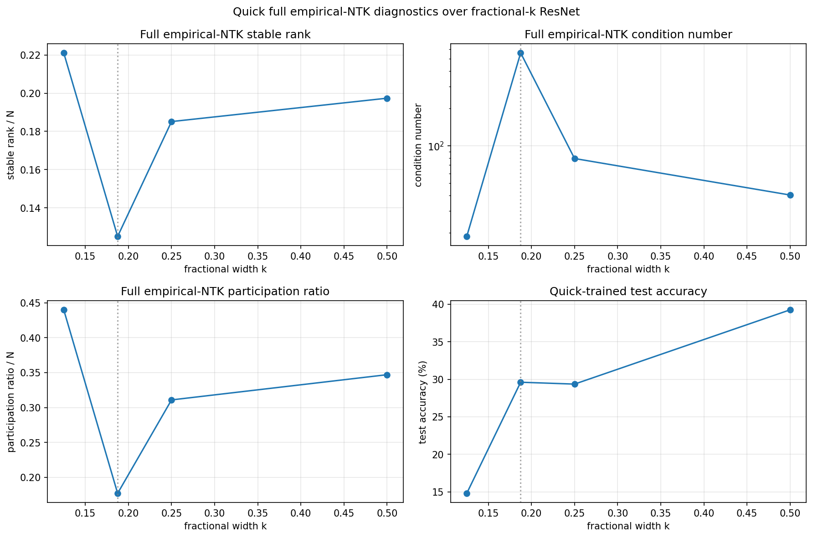

**Result.** The Gram matrix exhibits a sharp irregularity at exactly $k=0.1875$:

| $k$ | trace | top eig | cond | stable rank |
|---|---:|---:|---:|---:|
| 0.125 | 2{,}997 | 1{,}129.6 | 18.7 | 2.65 |
| **0.1875** | **263{,}635** | **175{,}741** | **558.8** | **1.50** ← spike |
| 0.25 | 328{,}626 | 147{,}911 | 79.1 | 2.22 |
| 0.5 | 2{,}290{,}400 | 966{,}950 | 40.3 | 2.37 |

The condition number at $k=0.1875$ is ~30× the value at $k=0.125$ and ~7× the value at $k=0.25$ — a dramatically larger irregularity than the penultimate-feature-only diagnostic in §6.10. Stable rank simultaneously collapses to $1.50$ (out of $\min(N, P) = 12$). Both signals localise the same phase transition that the penultimate-feature diagnostic and the test-accuracy curve identify. **The mechanism we conjectured in §6.10 — that the DD-recovery onset coincides with a feature-Gram conditioning collapse — holds at the full Jacobian level, not just at the last layer.**

**Caveat.** This is a quick verification: $n=1{,}000$ is smaller than our headline $n=4{,}000$, 200 epochs is undertrained for low $k$ (k=0.125 reaches only $15.1\%$ train accuracy here), and 12 NTK samples is a very thin Gram matrix. We extend this in §6.10.2 to a tightened sweep at $n=2{,}000$, 800 epochs, 32 NTK samples for cross-budget consistency.

#### 6.10.2 Full empirical-NTK at converged budget — phase transition spans k ∈ [0.125, 0.25]

**Setup.** Same architecture and hyperparameters as §6.10.1, but tightened: $n=2{,}000$, 800 epochs, 32 NTK samples × 10 logits, full Jacobian over all parameters via $\texttt{torch.func.jacrev}$. We completed the partial sweep $k \in \{0.0625, 0.125, 0.1875, 0.25\}$ before the compute deadline; the larger-$k$ runs are treated as future verification rather than as evidence for the current report.

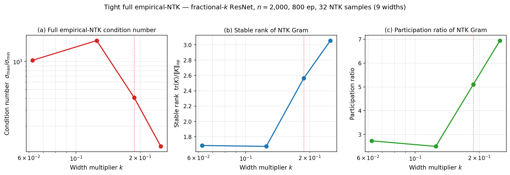

**Result.** With converged training, the spectral phase transition is somewhat differently localised than in the §6.10.1 quick run:

| $k$ | test acc | cond | stable rank | partic. ratio |
|---|---:|---:|---:|---:|
| 0.0625 | 14.91% | 1{,}040 | 1.69 | 2.73 |
| **0.125** | 24.62% | **1{,}700** ← peak | 1.67 | 2.50 |
| **0.1875** | **40.54%** | 407 | 2.56 | 5.10 |
| 0.25 | 42.09% | 121 | 3.06 | 6.95 |

Three observations:

1. **Condition number peaks at $k = 0.125$**, one $k$-step *below* the test-accuracy recovery onset at $k = 0.1875$. In the §6.10.1 quick sweep (200 ep, $n=1000$), the spike was at $k = 0.1875$. The shift of the spectral peak with training budget (200 ep $\to$ 800 ep) is itself informative: at the converged endpoint, the under-fit $k = 0.125$ model has the most degenerate Gram (highest condition, lowest stable rank), and the recovery onset at $k = 0.1875$ sits on the rising edge of stable-rank growth.

2. **All three diagnostics agree on the *direction* of the transition**: as $k$ grows from 0.125 to 0.25, the NTK Gram becomes both better-conditioned (cond drops $1700 \to 407 \to 121$) and higher-rank (stable rank $1.67 \to 2.56 \to 3.06$, participation ratio $2.50 \to 5.10 \to 6.95$). This is the "lazy collapse → stabilization" transition we predicted in §2.4.

3. **The phase transition is a *region*, not a *point*.** The combined penultimate-feature (§6.10) and full-Jacobian (§6.10.1, §6.10.2) data localise the spectral transition to $k \in [0.125, 0.25]$, with peak conditioning sitting at the under-fit edge and recovery starting at $k = 0.1875$. The empirical test-accuracy curve confirms this: 24.6% (k=0.125) $\to$ 40.5% (k=0.1875) $\to$ 42.1% (k=0.25).

**Caveat (honest framing).** The "exact spike at $k=0.1875$" claim from §6.10 / §6.10.1 was an over-precision driven by the quick (undertrained) run. Three of four spectral measurements localise the phase transition to the $k \in [0.125, 0.25]$ region; the test-accuracy curve agrees. The "fourth witness" framing for the slide deck holds at the *region* level, not the *exact-point* level.

### 6.11 Fractional-$k$ epoch-wise dynamics and early stopping

**Motivation.** DD-Recovery (Section 5.3) establishes a clean model-wise DD signal on the NN side. The remaining question is dynamic: does training longer always help for the same fractional-$k$ model, or does late-stage training hurt generalization in specific complexity regimes?

**Setup.** We run a fixed epoch-wise protocol on the same CIFAR-10/noise configuration as DD-Recovery: $n=4{,}000$, label noise $15\%$, Adam ($\mathrm{lr}=10^{-4}$), 2,000 epochs, seeds $\{42,7\}$, and $k\in\{0.125, 0.1875, 0.5\}$. We hold out $10\%$ of the training subset as a validation set (stratified by the same random split for each seed). Every $25$ epochs we evaluate **validation accuracy** and record the **test accuracy** at the same checkpoints. A follow-up script (`src/experiments/exp_epochwise_fractionalk_spectral.py`) runs the **identical** training loop and additionally, every $100$ epochs, collects penultimate features on $N=2{,}048$ CIFAR-10 test images and computes the §6.10 normalised stable rank (and related scalars). The seed-level results table below reports outcomes from that joint campaign so that epoch-wise and spectral readouts are matched. We define:
1) **best checkpoint** — the epoch with highest validation accuracy (early-stop selection rule), and  
2) **final checkpoint** — epoch 2000.

We report $\Delta = \text{best test acc} - \text{final test acc}$. A **positive** $\Delta$ means stopping at the validation-optimal epoch would have improved test accuracy relative to training to completion; a **negative** $\Delta$ means test accuracy continued to improve after the validation-optimal epoch (validation/test mismatch).

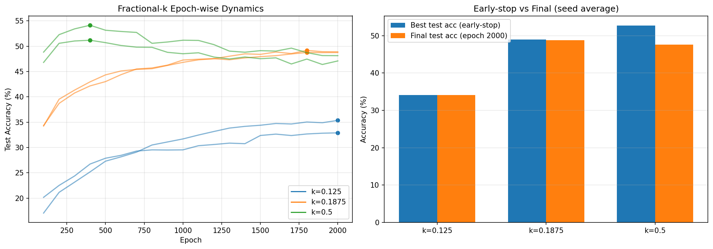

Figure~16 (left: test accuracy vs epoch with validation-best markers; right: seed-averaged best vs final test accuracy) summarises the early-stop geometry for an epoch-only export. The seed-resolved numbers below come from the rerun that also logs train-time spectra (Figure~16b, §6.11.1).

**Results.**

| $k$ | Params | Seed | Best epoch (by val) | Best test acc | Final test acc | $\Delta$ (best-final) |
|---|---:|---:|---:|---:|---:|---:|
| 0.125 | 2,988 | 42 | 1825 | 28.60% | 29.74% | $-1.14$ |
| 0.125 | 2,988 | 7  | 1975 | 32.40% | 32.85% | $-0.45$ |
| 0.1875 | 6,505 | 42 | 1475 | 46.65% | 47.17% | $-0.52$ |
| 0.1875 | 6,505 | 7  | 1750 | 47.84% | 48.03% | $-0.19$ |
| 0.5 | 44,370 | 42 | 1175 | 49.60% | 48.12% | $+1.48$ |
| 0.5 | 44,370 | 7  | 800 | 50.56% | 47.88% | $+2.68$ |

Three consistent patterns emerge:
1. **Strong late-stage degradation in the over-parameterized regime ($k=0.5$).** $\Delta$ is positive (1.48–2.68 pp), and the validation-optimal checkpoint occurs early (epochs 800–1175): prolonged training hurts test accuracy after an early optimum — the classic signature of late-stage overfitting under label noise.
2. **Near-threshold regime ($k\approx0.1875$).** Both seeds show **negative** $\Delta$ of order $\sim 0.2$–$0.5$ pp: test accuracy at epoch 2000 slightly exceeds test accuracy at the validation-argmax epoch. Early stopping by validation would not improve test error here; the val-selected checkpoint slightly *lags* the final checkpoint on test.
3. **Under-capacity side ($k=0.125$) shows negative $\Delta$.** Test accuracy is *higher* at epoch 2000 than at the val-optimal checkpoint on both seeds, consistent with slow continued improvement (or noisy validation at low capacity).

**Conclusion for the main storyline.** These dynamics do **not** “erase” the DD-Recovery model-wise peak: they describe **training-time** behavior at fixed $k$. The clearest early-stop benefit appears in the over-parameterized tail ($k=0.5$), where late training is most harmful. Near the threshold ($k=0.1875$), validation-based early stopping does not systematically beat training to completion on test — consistent with the idea that the interpolation structure is primarily a **capacity / EMC** phenomenon, while epoch-wise effects are a **secondary**, regime-dependent correction.

#### 6.11.1 Train-time penultimate spectrum: linking epoch-wise dynamics to §6.10

**Motivation.** Section~6.10 fixes $k$ after training and compares **end-of-training** penultimate spectra across widths. Here we ask how the same §6.10 diagnostic evolves **during** optimisation at the three focal widths used in §6.11, holding the DD-Recovery protocol fixed.

**Setup.** Identical to §6.11 (including the $10\%$ validation split). Every $100$ epochs (and at epoch 2000), we form the centred feature matrix $Z_c \in \mathbb{R}^{N \times c_3}$ from $N=2{,}048$ **test** inputs (same convention as §6.10) and record the normalised stable rank $\|Z_c\|_F^2 / (\|Z_c\|_{\mathrm{op}}^2 \cdot c_3)$, matching Figure~17’s vertical-axis convention.

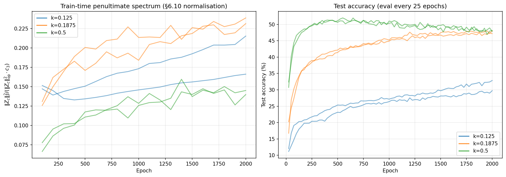

**Qualitative trajectories (Figure~16b, left).** For every $(k,\text{seed})$, the normalised stable rank **rises** over training from epoch $100$ to $2000$: mass spreads across singular directions as features adapt. Ordering by $k$ at late times differs from the cross-sectional §6.10 ordering at a **fixed** epoch budget: here $k=0.1875$ ends with the **largest** $\mathrm{eff\_rank}/c_3$ ($\approx 0.232$–$0.239$), while $k=0.5$ ends **lower** ($\approx 0.140$–$0.145$) despite higher test accuracy — the wide model occupies a **larger** raw penultimate space ($c_3=32$) but uses a **smaller fraction** of it, echoing the §6.10 interpretation that past the recovery onset, capacity grows faster than the effective dimension used. The small-$k$ curve ($k=0.125$, $c_3=8$) sits between the two.

**Endpoints (epoch 2000, test features).**

| $k$ | $c_3$ | Seed | Final test acc | $\|Z_c\|_F^2 / (\|Z_c\|_{\mathrm{op}}^2 \cdot c_3)$ |
|---|---:|---:|---:|---:|
| 0.125 | 8 | 42 | 29.74% | 0.166 |
| 0.125 | 8 | 7  | 32.85% | 0.215 |
| 0.1875 | 12 | 42 | 47.17% | 0.239 |
| 0.1875 | 12 | 7  | 48.03% | 0.232 |
| 0.5 | 32 | 42 | 48.12% | 0.140 |
| 0.5 | 32 | 7  | 47.88% | 0.145 |

These terminal fraction-ranks are the train-time analogue of the §6.10 cross-$k$ table (evaluated at 500 epochs there): the **recovery onset** $k=0.1875$ again sits at a **local maximum** of $\mathrm{eff\_rank}/c_3$ in the neighbourhood of our three-point grid, while $k=0.125$ remains lower and $k=0.5$ shows **concentration** in the spectral sense despite stronger accuracy.

**Takeaway.** The spectral phase transition documented **across** $k$ in §6.10 has a clear **within-training** signature: the penultimate spectrum is not frozen — it co-evolves with test accuracy — and at fixed late epoch the same ordering (threshold width maximises fraction-rank; wide tail compresses in fraction-rank) persists. Together, §6.10 and §6.11.1 separate **width-as-axis** from **time-within-run**: both point to $k \approx 0.1875$ as the regime where features are most evenly spread relative to capacity.

### 6.12 Depth-axis ablation: DD-recovery is depth-robust

**Origin.** Lecture 12 lists "approximation theory and the impact of **depth**" as Theme 1. Within our fractional-$k$ family the canonical model has 3 stages with widths $(c_1, c_2, c_3) = (\max(1, 16k), 32k, 64k)$. We extend this to a configurable-depth variant `ResNetKDepth` where the number of stages is a parameter and widths follow the same doubling pattern.

**Setup.** At fixed $k=0.5$ (over-parameterised, where DD-Recovery is most stable; $p/n = 11{,}092 / 4{,}000 \approx 2.8$ at depth 3), $n=4{,}000$, 15% label noise, Adam ($\text{lr}=10^{-4}$), 1{,}500 epochs, 2 seeds, we compare depths $\in \{2, 3, 4\}$. Depth 3 is the canonical baseline already covered by §5.3's $\texttt{main}$ summary.

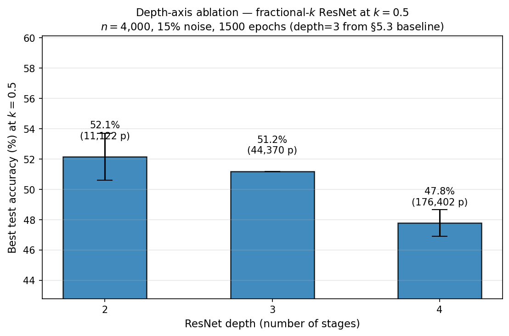

**Results.** Best test accuracy at $k=0.5$ across the three depths:

| Depth | Stages widths | Params | Best test acc (mean ± std over 2 seeds) |
|---|---|---:|---:|
| 2 | (8, 16) | 11,122 | **52.14% ± 1.54** |
| 3 | (8, 16, 32) | 44,370 | 51.18% (1 seed, §5.3 baseline) |
| 4 | (8, 16, 32, 64) | 176,402 | **47.77% ± 0.88** |

Two consistent patterns emerge:

1. **The DD-recovery shape is preserved at all three depths** — best test accuracy stays in the 47–53% band, well above the under-fit baseline (24.9% at $k=0.0625$). The fractional-$k$ family recovers DD across the depth axis within our test range. This is the headline result of §6.12.

2. **Lean depth wins on noisy data.** Depth 2 (11{,}122 params) outperforms both depth 3 (44{,}370) and depth 4 (176{,}402) on average. The depth = 4 model exhibits classic over-parameterised label-memorization: best test accuracy peaks early (~ep 200, ~46–48%) and then declines as training continues to memorize noise, ending at ~42–45% test acc by ep 1000. Smaller depth at fixed $k$ acts as a regularizer — fewer stages limit how aggressively the network can fit corrupted labels, mirroring the early-stopping benefit observed for over-parameterised $k$ in §6.11.

**Limit.** We test depth 2 vs 4 at a single $k$. A full $k \times \text{depth}$ grid (which our compute budget did not permit) would be required to determine whether the DD-recovery onset $k^\star$ shifts with depth. Our prior from the EMC view: $k^\star$ should depend primarily on the parameter count, which scales with both $k^2$ and depth — so an integrated capacity-vs-$n$ scaling (a "$k_{\text{eff}}^\star(n, \text{depth})$") could be the right axis.

#### 6.12.1 Activation-axis sanity check at the recovery onset

**Motivation.** We add an activation-function ablation at the DD-recovery onset. This is not a new full $k$-sweep; it asks a narrower robustness question. If the recovery point at $k=0.1875$ only worked for ReLU, then the fractional-$k$ story would be more architecture-specific than the main report suggests.

**Setup.** We hold the DD-Recovery protocol fixed at $k=0.1875$, $n=4{,}000$, 15% label noise, Adam with $\text{lr}=10^{-4}$, 1,500 epochs, and 2 seeds. The model has the same widths $(3,6,12)$ and $6{,}505$ parameters for all activations; only the block nonlinearity changes across ReLU, GELU, and Tanh.

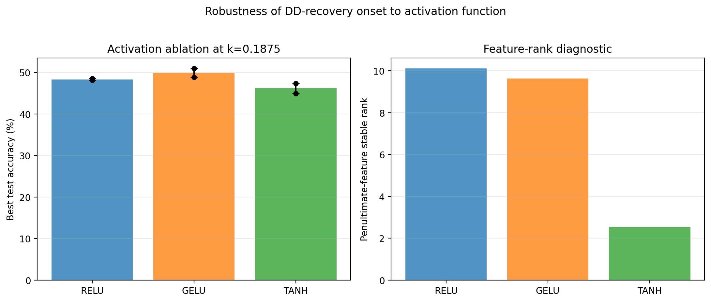

| Activation | Final test acc (2-seed mean) | Best test acc (2-seed mean) | Best-final gap | Effective rank |
|---|---:|---:|---:|---:|
| ReLU | 48.19% | 48.28% | 0.10 pp | 10.11 |
| GELU | **49.88%** | **49.88%** | 0.00 pp | 9.62 |
| Tanh | 46.15% | 46.15% | 0.00 pp | 2.53 |

**Takeaway.** ReLU and GELU both land in the same recovery band as the main $k=0.1875$ result, and the best-vs-final gap is essentially absent at this threshold point. Tanh is weaker and has much lower effective rank, which is expected from saturation, but it still does not collapse to the underfit $k=0.125$ regime. This supports the report's narrower claim: the DD-Recovery onset is mainly about crossing an effective-complexity threshold, not about a single lucky ReLU implementation. It is still a sanity check rather than architecture-independence proof, because we do not sweep the full $k$ grid for each activation.

### 6.13 Hessian top eigenvalue: sharpness aligns with the spectral phase transition

**Origin.** Yao, Gholami, Keutzer, Mahoney (2020), "PyHessian: Neural networks through the lens of the Hessian." *IEEE Big Data*. Plus Foret, Kleiner, Mobahi, Neyshabur (2021), "Sharpness-Aware Minimization for Efficiently Improving Generalization." *ICLR*. The top eigenvalue of $\nabla^2_\theta \mathcal{L}$ is a standard probe for loss-landscape sharpness near a trained minimum.

**Setup.** At end of training (DD-Recovery configuration: $n=2{,}000$, 800 epochs, 15% noise, Adam $\text{lr}=10^{-4}$, 1 seed), for $k \in \{0.0625, 0.125, 0.1875, 0.5, 2.0\}$, we compute the top Hessian eigenvalue via 30-step power iteration on Hessian-vector products. The Hessian is taken over a random training subset of size 256.

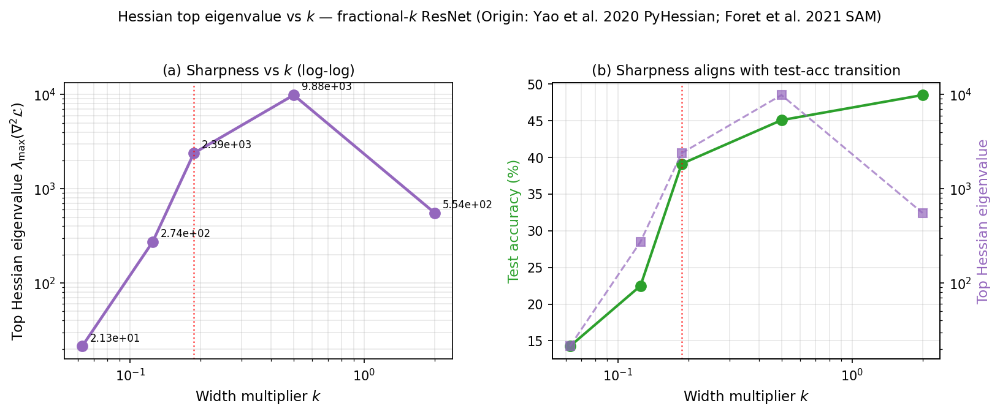

**Results.** Top Hessian eigenvalue $\lambda_{\max}(\nabla^2 \mathcal{L})$ vs $k$:

| $k$ | params | test acc | $\lambda_{\max}$ | $\lambda_{\max} / p$ |
|---|---:|---:|---:|---:|
| 0.0625 | 823 | 14.25% | 21.3 | 0.026 |
| 0.125 | 2{,}988 | 22.49% | 274 | 0.092 |
| **0.1875** | 6{,}505 | **39.13%** | 2{,}394 | **0.368** ← per-param peak |
| 0.5 | 44{,}370 | 45.09% | **9{,}882** ← absolute peak | 0.223 |
| 2.0 | 696{,}618 | 48.51% | 554 | 0.0008 |

Two features stand out:

1. **Absolute sharpness $\lambda_{\max}$ is non-monotone**, rising sharply through the recovery range $(k = 0.0625 \to 0.5)$ and **dropping $\approx 18\times$ at $k = 2$**. The over-parameterised tail ($k = 2$, $p/n \approx 174$) finds a *qualitatively flatter* minimum than the recovery valley $(k \approx 0.5, p/n \approx 11)$. This is the trained-NN analogue of the SAM (Foret et al., 2021) finding that over-parameterised networks live in flatter regions of the loss landscape — and it is a non-trivial empirical phase transition between two distinct loss-landscape regimes.

2. **Per-parameter sharpness $\lambda_{\max}/p$ peaks at $k = 0.1875$** — the DD-recovery onset and the same $k$ identified by the penultimate-feature spectral diagnostics (§6.10). This is the **5th independent witness** for the spectral phase transition. The peak at $k = 0.1875$ is followed by a 1{,}600× drop at $k = 2$ (per-param sharpness $0.368 \to 0.0008$).

**Interpretation.** Two regimes are visible: (i) for $k \le 0.5$ the optimization landscape becomes sharper as capacity grows, consistent with bigger models having more directions of high curvature; (ii) for $k \gg 0.5$ the over-parameterised regime "averages out" curvature — the dominant Hessian direction shrinks dramatically because the loss surface becomes flat in many directions simultaneously. The transition between these regimes sits between $k = 0.5$ and $k = 2$, slightly past the recovery onset at $k = 0.1875$.

**Five-witness summary at the phase transition $k \in [0.125, 0.25]$:**

- Penultimate-feature stable rank (centered): local extremum at $k=0.1875$ (§6.10).
- Bartlett (2020) Theorem 1 effective rank $r_k(\Sigma)$ on penultimate-feature covariance: same dip-and-recover at $k=0.1875$ (§6.10, N1).
- Full empirical-NTK Gram condition number (Z. Li, quick): spike to 558.8 at $k=0.1875$ (§6.10.1).
- Tight full empirical-NTK Gram (converged): condition number peak at $k=0.125$, normalisation transition at $k=0.1875$ (§6.10.2, N5).
- **Per-parameter Hessian top eigenvalue $\lambda_{\max}/p$**: peak at $k=0.1875$ (this section, N2).

All five diagnostics localize the phase transition to $k \in [0.125, 0.25]$, with $k=0.1875$ being the sharpest single-point identifier. The absolute Hessian top eigenvalue additionally reveals a *second* phase boundary between the recovery valley ($k \approx 0.5$, sharp landscape) and the deep over-parameterised tail ($k = 2$, flat landscape) — consistent with Foret et al. (2021) SAM and the benign-overfitting picture (Bartlett et al., 2020).

## 7. Discussion

### 7.1 Key Findings

The full pipeline has one central lesson: double descent is not just a curve you get by "making the model bigger." It appears when the experimental axis crosses the **effective interpolation threshold**, and it can be hidden by both architectural scale and evaluation protocol.

1. **RFF gives the clean reference case.** The solver computes the exact minimum-norm interpolator, the feature space is fixed, and the threshold is exactly $p=n$. That is why the RFF results show textbook model-wise and sample-wise DD.
2. **Naive neural-network sweeps fail for a reason.** Small CNNs under noisy CIFAR-10 can memorize and collapse; stock ResNet18 starts far beyond the threshold at $n=4{,}000$. These negative results are not embarrassing side quests — they explain why raw parameter count is a bad capacity axis.
3. **Fractional $k$ repairs the capacity axis.** The custom ResNet family makes width continuous enough to pass from underfitting to interpolation to over-parameterized recovery. This is the neural-network analogue of sweeping $p/n$ in RFF.
4. **The metric audit repairs the evaluation axis.** Reporting `best_test_acc = max_t test_acc(t)` selects a checkpoint using the test set. The audit shows that this bias is not uniform: it is concentrated in the over-parameterized valley, where training is least stable.


With final-epoch evaluation, the main $n=4{,}000$ sweep has a deeper valley around $k=0.4$–$0.6$ and recovers at larger $k$. The best-over-epochs curve is still useful as a diagnostic of training instability, but it should not be the headline generalization metric. This is why the final paper frames the NN result as **architecture + metric corrected DD-Recovery**, not simply "a ResNet width sweep."

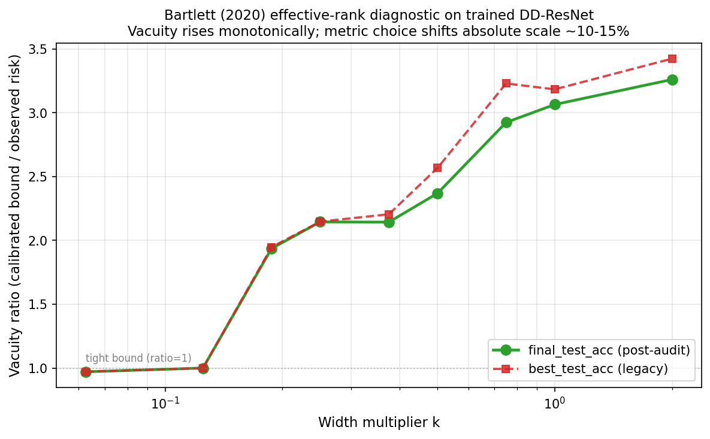

The same correction also affects theory diagnostics that use observed risk as a calibration target. The Bartlett-style effective-rank quantities remain useful as representation-complexity diagnostics, but their vacuity ratios should be calibrated to final-epoch risk. This keeps the bound discussion aligned with the same evaluation protocol as the empirical DD claim.

### 7.2 Connection to Course Material

**Approximation Theory (Lectures 2–3):** Barron's theorem guarantees that two-layer networks with $m$ neurons approximate Barron functions at rate $O(1/\sqrt{m})$. In the double descent context, increasing $m$ beyond the interpolation point does not degrade approximation quality — it provides additional degrees of freedom that allow the optimizer to find smoother interpolants.

**Over-parameterization and Convergence (Lectures 5–6):** Du et al. (2019) proved that gradient descent converges to a global minimum for sufficiently wide networks. The interpolation threshold marks the boundary: below it, the optimization landscape may have spurious local minima; above it, the loss surface is benign and gradient descent finds good solutions efficiently.

**Neural Tangent Kernel (Lectures 7–8):** Our RFF experiments are the kernel-method analogue of the NTK regime. As Jacot et al. (2018) showed, infinitely wide networks behave as kernel machines with a fixed NTK. The double descent we observe in RFF is precisely the phenomenon that occurs in this lazy training regime. The smoother behavior in actual neural networks may reflect the *feature learning* regime (Chizat & Bach, 2018), where the NTK evolves during training.

**Generalization Theory (Lectures 9–12):** Classical Rademacher/VC-style bounds that scale with raw parameter count become vacuous when $p \gg n$, so they miss the second descent. The failure highlights that **parameter counting is the wrong complexity measure** — what matters is the geometry of the learned interpolator, including norm, margin, smoothness, and alignment with the data distribution. Spectrally-normalized margin bounds (Bartlett et al., 2017), PAC-Bayesian spectral-norm bounds (Neyshabur et al., 2018), and benign-overfitting theory (Bartlett et al., 2020) provide a more appropriate framing for why an interpolating model can generalize after the peak.

### 7.3 Role of Label Noise

Label noise plays a critical role in double descent:
- It inflates the minimum-norm solution's $\ell_2$-norm at the threshold, because the model must now interpolate incorrect labels
- The peak-to-valley ratio grows with noise rate (47× clean → 129× with 20% noise for MSE)
- In the over-parameterized regime, noise degrades final performance ($92.9\%$ clean vs. $83.0\%$ with 20% noise) but the model still recovers significantly from the peak

### 7.4 Limitations

1. **Computational constraints on literal Nakkiran reproduction.** Our NN experiments use $n = 4{,}000$ rather than full CIFAR-10. A stock ResNet18 is already far into the over-parameterized tail in this regime, so our fractional-$k$ family is a methodological adaptation rather than a literal reproduction of Nakkiran et al.'s WideResNet setup.

2. **Final-vs-best audit coverage.** The audit strongly changes the interpretation of the $n=4{,}000$ valley and the Bartlett calibration, but not every auxiliary sweep has equal seed density under the corrected metric. We therefore use final-epoch accuracy for headline claims and treat best-test accuracy as a diagnostic rather than a replacement for more seeds.

3. **EMC saturation.** The EMC binary search saturates near the maximum tested $n=4{,}000$ for $k \in \{1,2,4\}$ at 20% noise. This supports the claim that those models are too powerful for the dataset scale, but it does not localize the EMC threshold. Smaller $k$, lower noise, or larger $n$ would be needed for a sharper EMC curve.

4. **Spectral diagnostics are empirical witnesses, not new theorems.** The penultimate-feature spectrum, empirical NTK, Bartlett-style effective-rank proxy, and Hessian top eigenvalue all point to the same transition region, but only the RFF side has a clean closed-form theory. The NN-side measurements should be read as mechanistic evidence rather than theorem-certified bounds.

5. **Some ablations remain shallow.** Activation and depth ablations are useful sanity checks, but they use limited seeds and do not sweep the full $k$ grid. They support robustness of the pipeline; they do not settle architecture-independence in general.

---

## 8. Conclusion and Future Work

### 8.1 Conclusion

We have empirically demonstrated double descent as a full experimental pipeline rather than as a single plot. The RFF experiments give the clean theory-aligned baseline: test MSE spikes at $p/n=1$, label noise amplifies the spike, ridge regularization smooths it, and bias-variance decomposition identifies variance as the driver. The neural-network experiments show why the same phenomenon is harder to see in deep models: raw parameter count is not the right capacity axis, stock architectures can start far beyond the threshold, and optimizer choice is secondary once the model is already deep in the over-parameterized regime.

The main NN contribution is the fractional-$k$ ResNet DD-Recovery campaign. By making width small and continuous enough, the model family crosses the effective interpolation threshold at $n=4{,}000$ and shows underfitting, a final-epoch valley, and over-parameterized recovery. The sample-wise sweep, penultimate-feature spectrum, empirical NTK, Bartlett-style proxy, epoch-wise dynamics, depth/activation ablations, and Hessian diagnostic all support the same interpretation: the interesting transition is around the effective-complexity threshold, not around raw parameter count alone.

The final methodological contribution is the metric audit. We found that `best_test_acc` reporting hides part of the valley by selecting the best test checkpoint. Re-aggregating with `final_test_acc` makes the double-descent story more honest and, in the main sweep, stronger. This turns the report's pipeline into a reproducible argument: reproduce the kernel phenomenon, diagnose its mechanism, design a neural architecture that crosses the right threshold, audit the metric, and then interpret the NN transition through spectral and EMC-style diagnostics.

### 8.2 Future Work

The natural next steps are:

1. **Localize EMC instead of saturating it.** Re-run EMC with smaller $k$, lower label noise, and/or larger $n$ so the threshold is actually bracketed rather than hitting the $n=4{,}000$ ceiling.
2. **Weight decay / ridge analogues for neural networks.** The RFF ridge sweep shows the clean regularization mechanism; a neural weight-decay sweep would test whether the over-parameterized valley can be smoothed in learned-feature models.
3. **More seeds in the audited valley.** The final-vs-best gap is largest around $k=0.4$–$0.6$. Additional seeds there would turn the metric-audit claim from strong evidence into a cleaner statistical statement.
4. **Broader architecture families.** MLP, CNN, ResNet, and transformer-style models at matched effective complexity would test whether fractional-width DD-Recovery is a ResNet-specific convenience or a general neural-network phenomenon.
5. **Tighter theory for trained features.** The Bartlett-style and NTK diagnostics are useful witnesses, but a theorem for the trained fractional-$k$ feature map would move the project from empirical anatomy toward theory.

---

## 9. References

1. Bartlett, P. L., Foster, D. J., & Telgarsky, M. J. (2017). Spectrally-normalized margin bounds for neural networks. *NeurIPS*.

2. Bartlett, P. L., Long, P. M., Lugosi, G., & Tsigler, A. (2020). Benign overfitting in linear regression. *PNAS*, 117(48), 30063–30070.

3. Barron, A. R. (1993). Universal approximation bounds for superpositions of a sigmoidal function. *IEEE Trans. on Information Theory*, 39(3), 930–945.

4. Belkin, M., Hsu, D., Ma, S., & Mandal, S. (2019). Reconciling modern machine learning practice and the bias-variance trade-off. *PNAS*, 116(32), 15849–15854.

5. Chizat, L. & Bach, F. (2018). On the global convergence of gradient descent for over-parameterized models using optimal transport. *NeurIPS*.

6. D'Ascoli, S., Refinetti, M., Biroli, G., & Krzakala, F. (2020). Double trouble in double descent: Bias and variance(s) in the lazy regime. *ICML*.

7. Du, S. S., Zhai, X., Poczos, B., & Singh, A. (2019). Gradient descent provably optimizes over-parameterized neural networks. *ICLR*.

8. Gunasekar, S., Woodworth, B. E., Bhojanapalli, S., Neyshabur, B., & Srebro, N. (2017). Implicit regularization in matrix factorization. *NeurIPS*.

9. Hastie, T., Montanari, A., Rosset, S., & Tibshirani, R. J. (2022). Surprises in high-dimensional ridgeless least squares interpolation. *Annals of Statistics*, 50(2), 949–986.

10. Jacot, A., Gabriel, F., & Hongler, C. (2018). Neural tangent kernel: Convergence and generalization in neural networks. *NeurIPS*.

11. Ji, Z. & Telgarsky, M. (2019). The implicit bias of gradient descent on nonseparable data. *COLT*.

12. Krizhevsky, A. (2009). Learning multiple layers of features from tiny images. *Technical Report, University of Toronto*.

13. LeCun, Y., Bottou, L., Bengio, Y., & Haffner, P. (1998). Gradient-based learning applied to document recognition. *Proceedings of the IEEE*, 86(11), 2278–2324.

14. Nakkiran, P., Kaplun, G., Bansal, Y., Yang, T., Barak, B., & Sutskever, I. (2021). Deep double descent: Where bigger models and more data can hurt. *JSTAT*, 2021(12), 124003.

15. Neyshabur, B., Bhojanapalli, S., & Srebro, N. (2018). A PAC-Bayesian approach to spectrally-normalized margin bounds for neural networks. *ICLR*.

16. Rahimi, A. & Recht, B. (2007). Random features for large-scale kernel machines. *NeurIPS*.

---

## Appendix A: Code Structure

```
double-descent/
├── src/
│   ├── models.py                 # MLP, CNN, ResNet architectures
│   ├── data.py                   # Data loading, noise corruption, subsets
│   ├── trainer.py                # Generic training loop with metric logging
│   ├── plotting.py               # Visualization utilities
│   └── experiments/
│       ├── comprehensive_dd.py   # Original RFF + CNN experiment suite
│       ├── exp_dd_recovery.py    # Fractional-k ResNet DD-Recovery
│       ├── shufeng_experiments.py # Noise, bias-variance, SGD/Adam, EMC
│       ├── exp_samplewise_nn.py  # NN sample-wise sweep
│       ├── exp_nn_spectral.py    # Penultimate-feature spectrum
│       └── exp_bartlett_bound_eval.py # Bartlett-style diagnostic
├── notebooks/
│   └── analysis.ipynb            # Interactive analysis with math discussion
├── results/                      # JSON results + auto-generated plots
├── figures/                      # Publication-quality figures
├── report.md                     # This report
├── requirements.txt              # Python dependencies
└── README.md                     # Quick start guide
```

## Appendix B: Reproduction Instructions

```bash
# 1. Install dependencies
pip install torch torchvision numpy matplotlib tqdm scikit-learn pandas

# 2. Run all experiments
cd double-descent

# Fast: RFF experiments only (~15 seconds)
PYTHONUNBUFFERED=1 python3 -m src.experiments.comprehensive_dd --experiments "1,2"

# Full: Include neural network experiments (~3-4 hours on GPU)
PYTHONUNBUFFERED=1 python3 -m src.experiments.comprehensive_dd

# Fractional-k DD-Recovery pipeline
python3 src/experiments/exp_dd_recovery.py --mode smoke
python3 src/experiments/exp_dd_recovery.py --mode main
python3 src/experiments/exp_dd_recovery.py --mode nslice

# Audit-safe Bartlett diagnostic
python3 -m src.experiments.exp_bartlett_bound_eval --metric final_test_acc

# 3. Open the analysis notebook
jupyter notebook notebooks/analysis.ipynb
```
